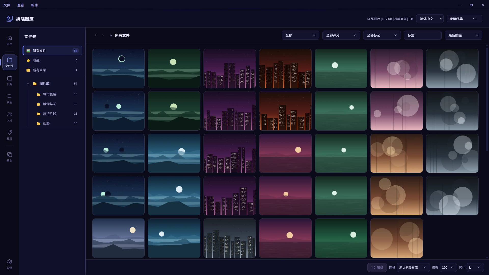
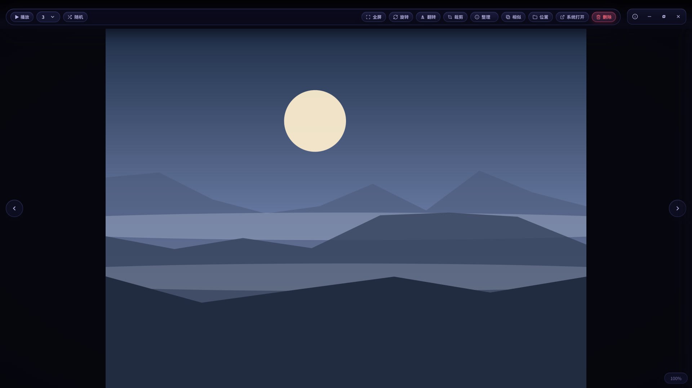
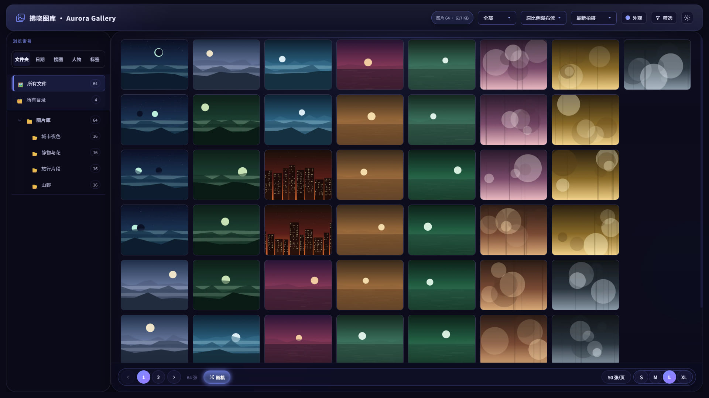
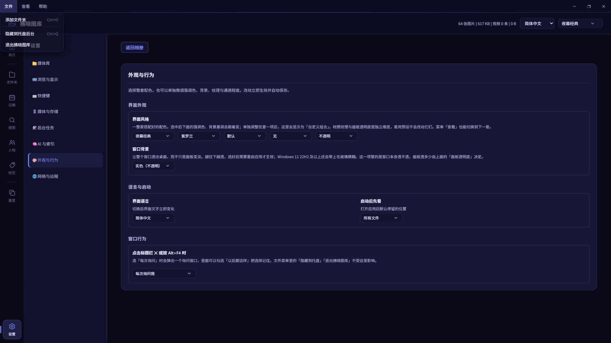

# Aurora Gallery · 拂晓图库

**Language / 语言:** [English](README.md) · [简体中文](README.zh-CN.md)

**Aurora Gallery** is an **Electron**-based, **local-first** photo library app. Media and indexes stay on your machine—suited for tens of thousands to millions of photos (including common RAW formats), with optional LAN browser access and remote tunneling.

|                         |                                                                             |
| ----------------------- | --------------------------------------------------------------------------- |
| **Chinese name**        | 拂晓图库 (UI and installed app name)                                        |
| **English name**        | Aurora Gallery (`package.json` description, installer filenames, repo name) |
| **npm package**         | `aurora-gallery`                                                            |
| **Bundle ID** (`appId`) | `com.foredawn.aurora-gallery`                                               |

**Current release:** `1.3.0` (same as [`package.json`](package.json) `version`; bump before shipping and sync “About” and similar strings).

**Release notes:** see [`CHANGELOG.md`](CHANGELOG.md).

## Author

**拂晓AI** — an AI product manager, not a programmer.

Aurora Gallery did not start as a software project. It started as an annoyance: a large personal photo collection, and a shelf of viewers whose interfaces were either dated or actively unpleasant to look at. The idea was never "build a photo library"—it was "these photos deserve a better container, and the tool has to be nice enough that I actually want to open it every day."

The timing was less a coincidence than a door being pushed open. On **2024-12-31**, the last day of the year, came the first contact with what is now called vibe coding—describing what you want in plain language, and watching a machine write it. The next morning, **2025-01-01**, the first personal homepage went live. It was a small thing, and it quietly replaced the question: not "can I build this?" but "what should I build?"

What followed was a year of watching the tools grow up. The toolchain moved from **Cursor** to **Claude Code** to **WorkBuddy**, and each move raised the ceiling a little: first a cleverer completion, then something that could hold a whole file in mind, then an agent that reads its own output and corrects itself. The domestic model families—Kimi, DeepSeek, Qwen, Doubao and their peers—grew alongside, and their change was qualitative rather than incremental. Early on they wrote code that looked right and quietly was not; later they learned to hold context, obey constraints, and admit uncertainty. What used to require a programmer's hands now requires a clear specification, the patience to check the result line by line, and the stubbornness to keep that specification honest.

Work on Aurora Gallery began in **April 2026**. Six months later it holds a library well past a million items, with local AI search, face grouping and a full editing workflow behind it—product definition, interface design and engineering delivery all done by one person, with no team and no hand-written framework code.

What the project is meant to demonstrate is not that AI can write code, but **how far one product manager can take it**. The hard part was never getting a model to produce working code; it was holding a hundred modules, a million-item dataset and a full interaction model together as something that can keep evolving—and treating how it looks and how it feels as a premise rather than a polish pass at the end.

- **2024-12-31** — first contact with vibe coding
- **2025-01-01** — first personal homepage goes live
- **2025** — toolchain moves Cursor → Claude Code → WorkBuddy; domestic models and agent tooling improve enough to attempt something real
- **2026-04** — first commit to Aurora Gallery
- **2026-10** — the library passes a million items; local AI, editing and organizing in place

### What this project demonstrates

- **Defining a product from scratch, not executing a spec.** It started from a real complaint—that the available viewers were not good-looking enough. The 22 theme presets, four window-backdrop levels and the non-destructive editing flow are product and taste decisions, not translations of a requirements document.
- **Taking AI tooling to engineering depth.** An Electron desktop app, a web client, local ONNX models, self-written image decoders, dual-platform packaging and CI—a chain that usually takes a team, walked end to end by one person with AI as the only collaborator.
- **Bringing engineering discipline to a solo project.** Ten contracts under [`docs/contracts/`](docs/contracts/) and 80+ regression guards under [`scripts/`](scripts/): behaviour established empirically gets written down and pinned. This is normally a large-team habit.
- **Respect for scale.** On the read and write paths of a million-item library, caching, a bounded worker pool and a single write admission point each do one job—performance is a design premise, not a later optimisation.
- **Patience to keep shipping.** Six months, four phases, 37 commits, from "usable" to "holds up" to "finds things"—every step recorded and auditable in [`CHANGELOG.md`](CHANGELOG.md).
- **Scale, without sprawl.** Roughly **180,000 hand-written lines**: about 112,000 of application code under [`src/`](src/) (third-party vendor files excluded), 55,000 of regression guards under [`scripts/`](scripts/), and 13,000 of documentation under [`docs/`](docs/) and the repo root. Close to a third of the codebase exists to keep the other two thirds honest.

Website: <https://foredawn.vip/>

## Highlights

- **Local-first, no cloud.** Media and indexes never leave your machine—no account, no upload, no cloud quota to run out of.
- **Built for the scale viewers give up at.** Hundreds of thousands to millions of items, common RAW formats included, kept responsive by caching, a bounded read pool and a single admission point for writes—rather than by the user's patience.
- **Local AI on your own hardware.** Semantic search from a sentence rather than a keyword, face detection and grouping into people, and zero-shot content tags behind a browsable tag tree. Every model runs on your machine; nothing is sent anywhere.
- **Optional access from anywhere.** A built-in web server with password protection for LAN access from a phone or tablet, and Cloudflare Tunnel when you need it from outside.
- **Editing and organizing, not just viewing.** Non-destructive rotate, flip and crop; ratings, flags and user tags; one filter model that stays consistent across the list, folder, date, search, tag and preview scopes.
- **Contracts backed by regression guards.** Behaviour established empirically is written down as a contract under [`docs/contracts/`](docs/contracts/); each one that matters has a regression script that fails the suite when it drifts—today that is 80+ scripts, from SQL execution plans down to whether a keyboard shortcut is actually wired to a handler.

## Screenshots

Four screens from the app itself, captured on a demo library of 64 generated illustrations—no personal photos, file paths or network addresses.



_Overview — photo grid, folder tree and filter bar._



_Preview — full-screen viewing with the rotate, flip, crop and organize toolbar._



_Web access — the same interface in a phone or desktop browser over your LAN._



_Appearance — interface style, accent colour, background and window behaviour._

## Features

High-level overview; details follow the in-app **Settings** pages.

### Library & scanning

- **Multiple roots**: maintain several photo root folders under **Album folders**, one unified index and browsing experience.
- **Incremental scans**: detect adds, changes, and removals; **pause / resume / cancel** with visible progress—suited for long runs on large disks.
- **Scan policies**: symlinks, depth, skip rules by folder name, whether to index RAW, etc. (see scan-related options in Settings).
- **Metadata in SQLite**: resolution, capture/modify time, size, paths; common image/video formats and **RAW**-friendly handling.
- **Format coverage**: on top of what `sharp` reads natively (JPEG, PNG, WebP, HEIF/AVIF, TIFF, GIF, SVG), self-written decoders cover BMP, ICO, PNM, TGA and QOI; RAW containers are served through their embedded JPEG preview.
- **Live Photo**: a paired still and its companion video are recognized as one item and kept out of the video list. Filename alone is not a reliable signal, so pairing uses the embedded content identifier and is recorded in both directions.
- **Thumbnails**: generated on first visit or on demand; background **backfill** for missing thumbs with tunable concurrency.

### Desktop browsing & preview

- **Navigation**: sidebar **folder tree**, **by date**, **search** results; works with “All files / All folders” and related entry points.
- **Preferences** (persisted): default **sort** (capture/modify time, name, size, path, etc.), **scope** (folder only / include subfolders), **page size**, **grid layout** (masonry, fixed height + aspect presets), card size, thumb crop, and more.
- **Favorites & OS integration**: favorites participate in filters; open files or folders in the **system file manager**.
- **Image preview**: zoom, pan, rotate, fullscreen; optional filename/time/size **info bar**.
- **Editing**: rotate, flip and crop from the preview. Actions are applied to the preview immediately but **written to disk only when you save**, so you can back out at any point. Saving rewrites the original atomically and refreshes its thumbnail and dHash in the same step; cropping can instead save as a new copy and leave the original untouched.
- **Video preview**: playback controls; **slideshow** (sequential or random); main window close behavior is configurable (see shortcuts help).
- **UI**: **22 theme presets** (11 dark / 11 light, including **glass / gradient** material tones) with independently adjustable accent color (**10**), background tone (**11**), **material texture** (**8**: grain / paper / linen / frost / grid / dots / stripes / wood) **panel opacity** (**3**: slight / medium / clear — only the UI chrome turns translucent; photos always stay opaque) and **window backdrop** (**4**: solid + acrylic light / medium / strong — the three acrylic levels make the **whole window** translucent so the desktop shows through, each level more transparent than the last; requires an app restart, and system blur needs Windows 11 22H2 or newer) (Settings → App; the top-bar dropdown switches them all, with **hover-to-preview** — window backdrop lives in Settings only, since it is a window-creation parameter that cannot be previewed before restart); **minimal UI** (hotkeys to hide chrome); **tray**: minimize to background with quick restore/quit.

### Startup & automation (General settings)

- **UI language** (简体中文 / **English**): under **Settings → General**; applies immediately and saves `uiLocale` (`zh-CN` / `en`) in `settings.json`. Updates the window title, tray tooltip, **static** copy (`data-i18n`), and **dynamic** UI: sidebar (folders/dates, favorites, loading states), bottom **stats bar**, Settings management pages (library list, LAN/Tunnel, maintenance tasks, alerts), and related strings. A **top bar** language selector may appear next to the theme control (hidden on very narrow widths; language remains in Settings). Release **1.0.3** documents the full zh/EN pass in [`CHANGELOG.md`](CHANGELOG.md).
- Optional: **scan on startup**, **backfill thumbnails after startup**, **find duplicates after startup** (coordinated with scan tasks).
- **Startup page**: welcome, all photos, all folders, or **last location**.
- **Close button**: title bar / Alt+F4 can ask every time, minimize to tray, or quit (see in-app shortcut help vs tray Quit).

### Filters, duplicates & search

- **Filters**: media type (all / photos / videos), dimensions, size, time range, folder scope, favorites, etc.; sidebar counts and “All folders” stay **consistent** with the active filter (empty folders can be hidden).
- **Duplicates**: **hash**-based grouping with a dedicated view.
- **Search**: indexed fields and syntax as shown in the UI.

### AI: semantic search, faces & tags

Local models only—nothing is uploaded. Indexes live beside the database and are built by background jobs with their own progress and admission gating.

- **Semantic search**: describe what you are looking for in words and images are ranked by similarity to the query. The encoder runs on your machine, and indexing is a resumable background job.
- **People**: face detection and grouping into people, listed in the sidebar with a name filter and inline rename. Grouping strictness is adjustable, and the threshold is stored with a version so a model or algorithm change migrates the setting instead of silently re-grouping.
- **Content tags**: zero-shot tags computed against the local index; they power the tag navigation page (see Organizing below).
- **GPU acceleration (optional)**: a probe decides once whether this machine can accelerate these jobs, and the answer is surfaced in Settings. CPU remains the fallback.

### Organizing: ratings, flags & tags

- **Ratings, flags and user tags**: set per photo from the preview's **Organize** drawer.
- **One filter model everywhere**: the same rating / flag / tag filter applies to the library list, the folder view, the date view, search results, the tag page and the preview scope.
- **Tag navigation page**: a three-level tree (category → subcategory → tag). Only tag leaves open a photo grid—parent nodes list their children, and tags with no matches are not listed at all, so “nothing here yet” and “nothing matches your search” stay distinguishable.

### Web & remote

- **Built-in web server**: over **HTTP** on the LAN without a separate backend.
- **Security**: optional **access password**; Settings shows server state, local URL, and password status.
- **Parity with desktop**: list/preview alignment—including **all / images / videos**, folder covers, preview transitions, random playback; **mobile**-friendly touch and swipe.
- **Video & subtitles**: sidecar `.vtt` / `.srt` / `.ass`; web preview can toggle subtitles and adjust size/position. Large or special cases may use **HLS** streaming to reduce decode/bandwidth load.
- **Public access (optional)**: **Cloudflare Tunnel** (`cloudflared`); the build can bundle `cloudflared` (see build scripts) or use a binary on `PATH`.

### Maintenance & data

- **Database**: single-file **SQLite** (`photos.db`); **cleanup**, **VACUUM**, **backup**, and related tools (see Settings and “Thumbnails, preview & data”).
- **Background jobs**: thumbnail backfill, duplicate hashing, etc., with progress; **HLS cache** limits to avoid filling the disk.
- **Data location**: per-user app data (dev vs packaged naming differs); do **not** commit `photos.db` to Git.
- **Recommendation**: **back up** `photos.db` before large imports, migrations, or experimental cleanup.

### Data safety & backup

The database is a single SQLite file (`photos.db`). Backing it up is as simple as copying the file while the app is **not running**.

**When to back up**

- Before adding a very large folder for the first time
- Before upgrading the app to a new version
- Before running experimental cleanup or VACUUM in Settings

**How to back up**

1. Close the app completely (tray icon → Quit).
2. Locate `photos.db`:
   - **Dev**: in the OS app-data directory (Electron `app.getPath('userData')` with the dev app name).
   - **Packaged**: in the per-user app data folder for `aurora-gallery`.
3. Copy `photos.db` to your backup location.

**How to restore**

1. Close the app completely.
2. Replace the current `photos.db` with your backup copy.
3. Restart the app.

> Do **not** commit `photos.db` to Git.

## History

From the first commit (2026-04-05) to now—roughly six months, in four phases.

- **2026-04 · Make it usable.** Web preview with mobile swipe, a loading state between images and subtitle support (`1.0.1`); then a full zh-CN / English pass that covered the _dynamic_ UI—sidebars, stats bar, settings pages—rather than only the static strings (`1.0.2`).
- **2026-05 · Make it hold up.** 70 ESLint errors down to zero, orphaned modules deleted, and a levelled logger in place (`1.0.3`); structured task logging for scan, thumbnail backfill, duplicate hashing and HLS (`1.0.4`); per-stage scan telemetry, preview cache busting, and a web server serving `ETag` / `304` (`1.1.0`).
- **2026-09 → 10 · Make it find things.** Semantic search built on SigLIP 2 (~412 MB), face detection and grouping with YuNet + InsightFace and Chinese Whispers clustering (~13 MB), and side-by-side photo comparison—recorded as `1.2.0`, with no breaking database migration for existing libraries.
- **2026-10 → now · Make it yours.** A dedicated home page, user-definable shortcuts, panel opacity and window backdrop as new appearance dimensions, path crumbs and navigation history, AI content tags and a tag tree (`1.3.0`); then ratings, flags and user tags, non-destructive rotate / flip / crop, Live Photo pairing, self-written decoders for the formats libvips cannot read, and a GPU capability probe.

Per-version detail lives in [`CHANGELOG.md`](CHANGELOG.md).

## Requirements

- Windows 10/11, macOS (Apple Silicon / Intel)
- Node.js `>=22.0.0 <23.0.0`
- npm 10+

> Native deps include `better-sqlite3` and `sharp`; rebuild after changing Node/Electron versions.

### Environment lock

**Recommended stack**

- Node.js `>=22.0.0 <23.0.0`
- Electron `^41.5.0` (see `package.json`)

**Upgrade strategy**

1. Upgrade Node.js to the desired version (stay within the supported range).
2. `npm install`
3. `npm run rebuild-native`
4. `npm start`

**Native module troubleshooting**

If you see `ERR_DLOPEN_FAILED` on start:

```bash
npm run rebuild-native
```

If it persists:

```bash
npm install
npm run rebuild-native
```

This error means a native dependency was compiled for a different Node/Electron ABI. Rebuilding always fixes it when the Node version is within the supported range.

## Install & run

```bash
npm install
npm run rebuild-native
npm start
```

Development:

```bash
npm run dev
```

## Scripts

- `npm start` — launch desktop app
- `npm run dev` — dev mode
- `npm run rebuild-native` — rebuild native modules (`better-sqlite3`, `sharp`, `onnxruntime-node`)
- `npm run lint` — ESLint
- `npm run format` — Prettier
- `npm run pack` — unpacked dir (`electron-builder --dir`)
- `npm run dist` — installer for current platform (runs `download-cloudflared`)
- `npm run dist:win` — Windows installer (NSIS)
- `npm run dist:mac` — macOS DMG
- `npm run download-cloudflared` — fetch `cloudflared` for packaging or local tunnel
- `npm run bundle-models` — build the bundled AI models into `models/` (face detector + recognizer, semantic-search encoder) for packaging; `--face-from` / `--search-from` copy from an existing cache instead of downloading
- `npm run smoke:db` — DB smoke test (`scripts/db-smoke.js`)

## Build artifacts

### Windows

```bash
npm install
npm run dist:win
```

Typical outputs (version matches `package.json`, e.g. `1.0.3`):

- Installer: `release/AuroraGallery-Setup-<version>.exe`
- Unpacked: `release/win-unpacked/`

### macOS

```bash
npm install
npm run dist:mac
```

Typical outputs:

- DMG: `release/AuroraGallery-<version>.dmg`
- Unpacked: `release/mac/` or `release/mac-arm64/`

## CI / Automated builds

Push a tag matching `v*` to trigger the GitHub Actions workflow (`.github/workflows/release.yml`). It builds **Windows** (`windows-latest`) and **macOS** (`macos-latest`) in parallel and uploads artifacts to a GitHub Release.

```bash
git tag v1.3.0
git push origin v1.3.0
```

The workflow automatically downloads the correct `cloudflared` binary per platform, rebuilds native modules, runs `electron-builder`, and publishes the installers to the release page.

## Project layout

```text
src/
  main.js                  # Electron main entry (orchestrates modules below)
  preload.js               # Secure bridge (photoAPI)
  web-server.js            # Built-in web (API, static, video/subtitles/HLS)
  database.js              # SQLite access
  scanner.js               # Folder walk and incremental diff
  scan-worker.js           # Scan worker thread
  playback-strategy.js     # Direct playback vs HLS
  hls-session-manager.js   # HLS session lifecycle
  hls-attach.js            # Bind the chosen strategy to the player
  video-probe.js           # ffmpeg probe (duration / codec), memoized
  video-frame-thumb.js     # Video first-frame thumbnail and placeholder
  db-heavy-read.js         # Heavy-read SQL, shared with the worker pool
  db-read-runner.js        # Dispatch heavy reads into the pool
  db-read-worker-pool.js   # Bounded pool for heavy reads (3 workers, queue 100)
  catalog-cache-db.js      # Separate SQLite cache behind browse counts
  photos-total-cache.js    # Memoized `getPhotos` total
  stats-agg-cache.js       # Memoized `getStats()` aggregates

  main/                    # Every file here is reached from main.js at runtime
    db-write-queue.js       # The single write-lock admission point, 4 priority tiers
    data-dir.js             # Where the library data lives: probe, migrate, verify
    deferred-indexes.js     # Deferred (Phase 5) index DDL — single source of truth
    exif-meta.js            # EXIF parsing — the only entry point
    file-hash.js            # Duplicate fingerprints; both callers share one SHA-256
    perceptual-hash.js      # dHash computation
    thumb-format.js         # Thumbnail encoding format — single source of truth
    thumb-regen-queue.js    # Materialized queue for a full thumbnail re-run
    sharp-input.js          # "libvips cannot read this" -> a sharp-acceptable input
    image-decoders/         # Decoders for the formats libvips cannot read
      index.js               #   BMP / ICO / PNM / TGA / QOI (sharp is tried first)
    raw-preview.js          # Embedded JPEG + EXIF out of RAW containers
    image-edit.js            # Pixel-level edit ops, shared by desktop IPC + web API
    photo-edit-service.js   # Post-write orchestration: thumb, dHash, row, caches
    live-photo.js           # Recognize a paired still and its companion video
    live-photo-pair.js      # Pairing task; records both directions
    org-meta-filter.js      # Org-metadata domains and filter predicates
    photo-list-columns.js   # The columns a photo list row carries
    progress-pct.js         # Task progress percentage — single source of truth
    eta.js                  # Task ETA estimation — single source of truth
    ai-index-gate.js        # Whether an AI index job may start (VACUUM / rebuild only)
    face-service.js         # Face detection / grouping worker
    semantic-search.js      # Semantic (text -> image) search worker
    semantic-tags.js        # Zero-shot content tags (read-only index connection)
    similar-detection.js    # Visual similarity grouping
    tag-nav.js              # Read-only tag-index service (tree / tags / photos)
    gpu-probe.js            # Whether this machine has usable GPU acceleration
    browse-requests.js      # Browse request coalescing
    interaction-preempt.js  # User interaction preempts background tasks
    maintenance-guard.js    # Maintenance busy gating
    database-maintenance.js
    sql-id-list.js          # Safe `IN (...)` builder (host parameter limit)
    startup-metrics.js      # Startup stage timing
    logger.js               # Structured logging with level control

  renderer/
    index.html              # Desktop shell
    styles.css              # Base styles
    theme-polish.css        # Theme layer on top of styles.css
    navigation.css          # Sidebar, tree and breadcrumb styles
    app.js                  # Desktop orchestration
    api.js
    settings.js
    logger.js               # Renderer-side logging
    i18n.js                 # zh-CN / en UI copy via data-i18n
    utils.js                # Shared value domains (card size, page size, grid ratio)
    shortcuts.js            # Keyboard shortcut registry — single source of truth
    shortcut-settings.js    # Shortcuts settings panel
    nav-history.js          # Back / forward stack and button state
    path-crumbs.js          # Breadcrumb segmentation, folding and dropdown
    sidebar-tree.js
    ui-shell.js
    ui-events.js
    ui-navigation.js
    ui-grid.js
    ui-preview.js
    ui-overlays.js          # Dialogs and overlay layers
    ui-settings.js
    ui-duplicates.js
    preview-flow.js
    preview-crop.js         # Crop selection inside preview
    org-meta-ui.js          # Rating / flag / user-tag UI
    ai-views.js             # Search and people views adapted onto the photo grid
    ai-views.css
    tag-nav-ui.js           # Tag navigation page UI
    tag-nav.css
    qr-code.js              # QR rendering adapter (wraps the vendored encoder)
    scan-flow.js

  web/
    index.html              # Web app shell (main styles inline)
    login.html
    vendor/hls.min.js
    css/                    # Stylesheets shared with the desktop renderer
      gallery-design.css
      people.css
      photo-compare.css
      semantic-search.css
      settings-page.css
      tag-nav.css
      ai-web-views.css
    js/
      app.js                # Web app logic
      ai-views.js           # Search and people views (sidebar-only)
      people.js             # Face grouping thresholds (mirrors ai/face-settings.js)
      photo-compare.js      # Compare selection and viewer
      photo-info-fields.js  # Optional info-panel fields — single source of truth
      semantic-search.js    # Match threshold range (mirrors ai/index-store.js)
      settings-page.js      # Per-device browsing preferences
      tag-nav.js            # Tag navigation page
      web-theme-shared.js   # Web theme model, mirrors the desktop tokens
```

> Every module under `src/main/` must be reachable from `main.js` / `preload.js`; `scripts/module-reachability-regression.js` fails the suite if an unreachable file appears. Editing a file that nothing `require`s changes nothing at runtime — that is how the `width`/`height` backfill contract once went missing (2026-10-05).

## Module overview

```text
Desktop (Electron)
renderer/* UI
  -> renderer/api.js
  -> preload.js (photoAPI)
  -> main.js (ipcMain)
  -> database.js / scanner.js / web-server.js

Web (browser)
web/index.html
  -> web-server.js (/api/*, /photo/*, /video/*)
  -> database.js
  -> hls-session-manager.js + playback-strategy.js
```

- Desktop data paths go through `photoAPI` / IPC, not direct DB access from the renderer.
- Web traffic is served by `web-server.js` (API, media, subtitle conversion).
- Playback path (direct vs HLS) is decided in `playback-strategy.js`; HLS sessions in `hls-session-manager.js`.

## Data & config

- App data lives under the current user; do not commit `photos.db`.
- DB file: `photos.db` in the app data directory.
- Settings: managed by the main process.
- Thumbnails: stored in `photos.thumbnail` in the database.

## Development notes

- Run `npm run rebuild-native` before first start to avoid native ABI mismatches.
- `src/renderer/app.js` and `src/main.js` are large—prefer small, focused commits.
- Scanning, hashing, and thumbnail jobs are heavy—watch progress and error paths.

## FAQ

### `ERR_DLOPEN_FAILED`

Usually a native module / Node ABI mismatch:

```bash
npm run rebuild-native
```

If it persists:

```bash
npm install
npm run rebuild-native
```

### Some folders missing after scan

- Confirm roots were added successfully.
- Check whether the scan was paused or cancelled.
- Review skip rules in scan settings.

### Incomplete thumbnails

- Ensure files are indexed.
- Run thumbnail backfill and wait for completion.

## License

MIT — see [`LICENSE`](LICENSE) for the full text.
