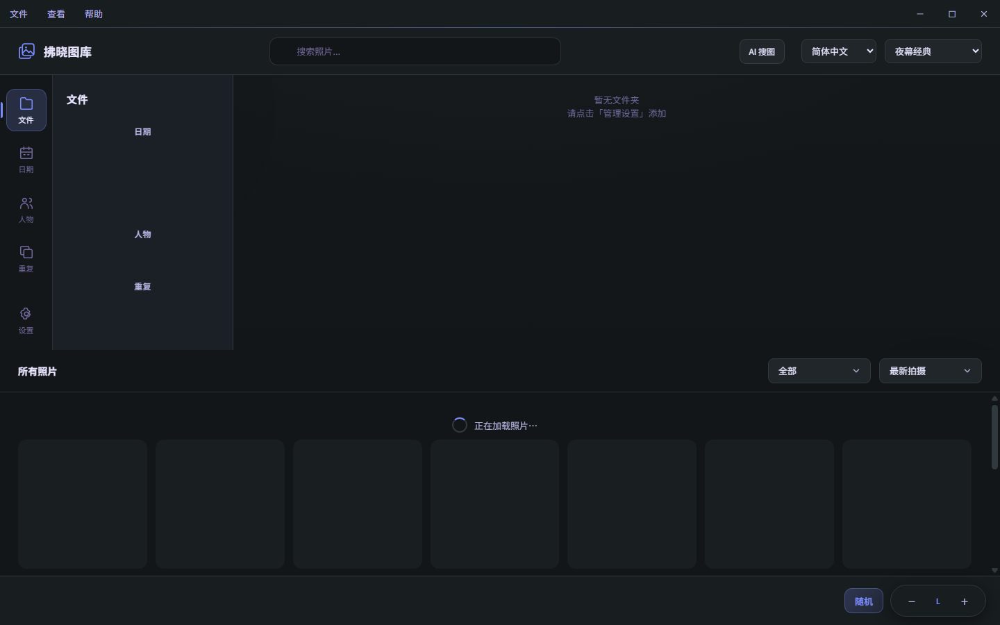
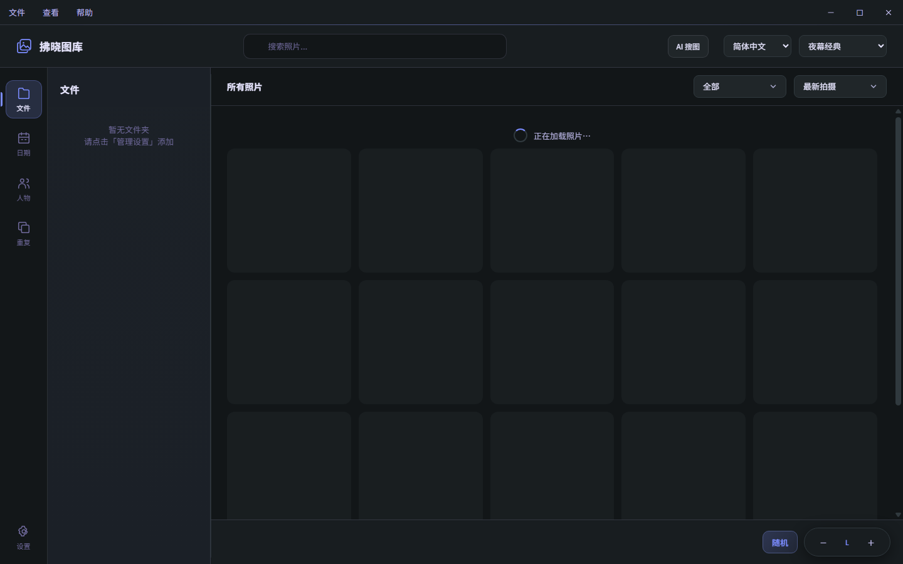

# 桌面三栏布局

最左侧固定图标导航：**文件、日期、搜图、人物** ｜ **重复、设置**。图标附短标签、悬停提示和键盘焦点，当前页面使用强调色及侧边标记。

两组之间的分隔线（`.app-rail .rail-divider`）是**有语义的**，不是装饰：上半是「换内容看的视图」，下半是「干活用的工具与配置」。`设置` 另有 `.rail-settings { margin-top: auto }` 钉到底部。删掉分隔线，「重复」在视觉上就会退化成第五个视图。

中间栏沿用可调整宽度的侧栏，随页面显示目录树、日期、人物入口、重复分组或设置分类。设置分类使用独立容器，避免覆盖文件目录树；可直接从图标栏离开设置。

右侧显示照片、人物及其关联照片、重复项或设置内容。模型、索引和识别参数位于「设置 → AI 与索引」里的「搜图索引 / 人物索引」两节（设置项直接铺开，不再折叠），人物页与搜图页各自提供跳转入口。顶部原有管理设置按钮已移至图标栏底部。

### 底栏（浏览页右下角）契约

内容区底部一条 `.browse-footer`：左侧是分页条（`#pagination`，单页时整条隐藏），右侧 `.browse-footer-actions` 里依次是 **随机跳页 → 网格与比例 → 每页数量 → 卡片尺寸**。

**后三个是同一副外形：小标签 + 紧凑下拉**（`div.browse-footer-field` > `label.browse-footer-label` + `select.sort-select.browse-footer-select`）。此前「每页数量」「卡片尺寸」是两个 −/+ 药丸，读数只有 `100`、`L` 这类字符，不点开不知道是什么；改成带标签的下拉之后三件同形，也跟设置页的三份（`#settingBrowseGridStyle` / `#settingBrowsePageSize` / `#settingBrowseCardSize`）长得一样。

**皮肤不在这里定义**：它们吃 `select.sort-select` 的「紧凑档」共享声明（`styles.css` 顶部那一节，设置页与底栏同一批），`label` 与排布才归 `.browse-footer-field` 一族管。**唯独高度是底栏自己的**：这一排左右都是 `height: var(--browse-bar-control-h, 36px)` 的按钮（分页与「随机」），下拉沿用设置页那档 30px 会矮一截、底边不齐，所以 `.browse-footer select.sort-select` 把 `height` / `min-height` 覆写成同一条变量 —— **用变量而不是写死 36px**，窄屏 ≤600px 时 `--browse-bar-control-h` 会降到 32px，写死的话下拉就不跟着缩了。宽度**按内容自适应**（select 的固有宽度 = 最长选项 + 内距），只有 `max-width` 上限与纯数字档（每页 / 尺寸）的 `min-width: 68px`：写死宽度会在另一种语言下把文字直接截断。

三者**行为各不相同，别照抄**：

| 控件 | 落库 | 重查库 | 说明 |
| --- | --- | --- | --- |
| 卡片尺寸 | 否 | 否 | 只改 CSS 变量当场重排 |
| 每页数量 | 是 | 是 | `updateSettings` → 整体重放 → `state.page = 1` → `loadPhotos` |
| 网格与比例 | 是 | 否 | 布局模式是**渲染时**写进卡片 DOM 的，落库后重画当前页即可 |

三处失败都要**回滚读数并提示** —— 否则界面会显示一个并没生效的值。

档位表 `BROWSE_PAGE_SIZE_TIERS`（`[10, 20, 50, 80, 100, 200]`）住在 `src/renderer/utils.js`，是渲染端唯一一份。**收档必须「取最近档位」而不是判非法丢弃**：下拉的 `<select>` 遇到表外值会匹配不到任何 `<option>`，直接赋 `value` 会让它显示成**空白**（比原来「按不动」更难懂）。比例取值域同理收敛在 `utils.js` 的 `BROWSE_CARD_RATIOS` 一族，`app.js` / `settings.js` 只留转发。

**可见性收在一个 helper 里**（`ui-navigation.js` 的 `setBrowseGridControlsVisible`，管 `browseGridStyleControl` / `pageSizeControl` / `zoomControl` **三个外层 field** —— 可见性挂 field 而不是挂 select，标签要跟着一起收）。这三个原先靠四五个地方各自 `getElementById(...).style.display` 维持可见性，新加一个控件时只要漏掉一处，就会出现「进了重复页还留着半截底栏控件」。智能视图（搜图 / 人物）另有两条例外：结果集固定只有一页（`previewTotalPages = 1`），「每页数量」跟着随机跳页、「网格与比例」跟着媒体筛选一起收掉（后者那两页没有「按当前结果重画」的入口，留着会点了没反应），而卡片尺寸只改 CSS 变量，仍然可用。

守护：`page-size-control-regression` 覆盖收档 / 换档落库重查 / 写失败回滚 / 设置页改完读数同步与静态接线（事件绑定、dom 映射、`onApplyPageSize` 每个应用点都传、档位表四处同源）；`browse-grid-style-regression` 覆盖取值域往返、两处下拉逐位一致、落库 + 重画不重查、失败回滚，以及**「高度与「随机」/ 分页按钮同源」**（含夹具自证：必须取到那条独立规则而不是共享选择器列表里的同名一项，并断言设置页没被顺手撑高）。

### 设置页的信息架构契约

设置页是**两栏 6 面板**：左栏 `#settingsSidebar` 是类目导航，右栏同一时刻只显示一个 `[data-settings-panel]` 面板（CSS 靠 `.is-active` 切换显隐，切换时把 `#settingsPage` 滚回顶部）。`ui-settings.js` 里 `navItems` 的顺序**必须与 `index.html` 中面板的 DOM 顺序逐位一致**——顺序错位的症状是「点左栏某一项、右栏显示的却是另一项」。navigation-regression 会把两边解析出来做逐位比对（解析而非硬编码期望值，增减面板不会假红），并校验每个面板都带 `data-settings-panel`。

8 个面板按语义归类，不再按内容类型平铺：

- `settingsSectionFolders` 媒体库 —— 相册目录增删与重扫
- `settingsSectionBrowse` 浏览与显示 —— 浏览偏好（排序 / 分页 / 视频点击）与字幕字体样式
- `settingsSectionShortcuts` 快捷键 —— 键盘动作绑定（唯一真相源 `src/renderer/shortcuts.js`）
- `settingsSectionStorage` 媒体与存储 —— 缩略图尺寸质量与 HLS 缓存上限
- `settingsSectionTasks` 后台任务 —— 立即执行（缩略图补全 / 重复比对 / 数据库维护）与自动执行（三个启动开关 + 视觉相似阈值），**只放纯任务**
- `settingsSectionAiIndex` AI 与索引 —— 搜图索引 `#settingsAiSearchMount` / 人物索引 `#settingsAiPeopleMount`，含模型、索引与识别参数，设置项**直接铺开**
- `settingsSectionAppearance` 外观与行为 —— 界面风格、强调色、背景、纹理、面板透明度、窗口背景
- `settingsSectionNetwork` 网络与远程 —— 局域网访问开关与地址、访问密码、Cloudflare Tunnel

后四块原本挤在同一个 `settingsSectionMedia` 里（字幕属播放、缩略图与 HLS 属存储、三个任务属后台），一个区块横跨三个语义，现已拆开归位。

**「后台任务」是「让机器干活」的归口处，但只放纯任务。** 长跑任务原先散在三处：「应用 → 通用设置」放着一排「启动时自动…」开关，「后台任务」放三个立即执行按钮，「搜图 / 人物」各有自己的建立 / 更新索引。同一个意图（把活干完）要在三个面板里翻，所以三处收进后台任务：三个启动开关与「视觉相似阈值」（本质是查重参数，跟「重复照片比对」是一件事的两半）进「自动执行」小节；两个 AI 索引整块搬去「AI 与索引」（见下条）。

**搜图 / 人物两个索引块住在「AI 与索引」（`settingsSectionAiIndex`），且设置项一律直接铺开。** 这两块经历过一整轮反复：各自成一个类目 → 2026-09-28 并进「后台任务」当两行 → 2026-10-05 又拆出来独立成面板。并进清单行的代价是**识别设置 / 匹配设置只能折叠成一个 `
`**（不折的话，展开的表单会比同清单其它任务行高出一个量级），而用户明确反馈「不要存在设置项按钮隐藏」——折叠是**为「塞进一行」做的妥协**，不是这类参数本身的属性，所以整块搬进独立面板后折叠一并取消：`people.js` 出 `section.people-settings`、`semantic-search.js` 出 `section.ai-tune`，加载时机从 `
` 的 `toggle` 事件改为 `refresh()` 的状态回调（面板可见即加载）。⚠️ 折叠消失会顺带带走一条可见线索：原先 `
匹配设置
` 是阈值输入框**唯一**的可见名字，故补了「匹配阈值」标签（`.ai-tune-label`）。守护 `navigation-regression`（面板顺序与挂载点归属）+ `people-page-regression`（无 `details`、无 `summary`、设置块仍在，且不做任何交互就能读到真值）。

同样地，「自动执行」里的**三个启动开关 + 视觉相似阈值**是从「应用 → 通用设置」搬来的（`autoThumbBackfillOnStartup` 也补上了 dHash：它现在是「缩略图 + 视觉指纹」一件事）。

**但没有加「开机自动建 AI 索引」开关**（搬进来的是入口，不是自动化）：首次索引是整库级、数天级，搜图 worker 常驻内存约 900MB，与「补缩略图」这种可预期增量不是一个量级；而且 `canRun` 让两套 AI 索引彼此互斥、也与数据库维护互斥，真让它随开机跑，「优化数据库」按钮就会随机变灰。要做也得先补「扫描全部完成」的钩子，再加一个「暂停自动任务」的总闸。

**设置页导航图标一律用彩色 emoji。** ✦ / ☺ / ⟳ 这类文本符号在 Windows 上走 Segoe UI Symbol，会被渲染成单色灰字，夹在一排彩色 emoji 中间就是断层（后台任务曾用 ⟳，实测渲染成空心圆才换成 🛠️）。当前 8 项：📁 媒体库 / 🎞️ 浏览与显示 / ⌨️ 快捷键 / 🗄️ 媒体与存储 / 🛠️ 后台任务 / 🧠 AI 与索引 / 🎨 外观与行为 / 🌐 网络与远程。⚠️ 图标栏（左栏视图）的 🔍 搜图 / 👤 人物是**视图入口**，与设置页那 8 项不是一回事——「AI 与索引」面板把这两件事合成一项，故用 🧠 而不是复用 🔍。换图标不参与回归断言，但换回文本符号前务必在 Windows 下看一眼实际渲染。

**搜图与人物是两套独立能力，合成一个面板不是因为「共享开关」。** 它们各有模型、索引文件与 IPC（`faceAction` 对 `aiSearchStatus` / `Install` / `Index` / `Cancel`，**不共享任何开关**），合在 `settingsSectionAiIndex` 的理由是两者同属「本机 AI 索引」这一类，而不是有共同配置；面板内因此仍分成「搜图索引 / 人物索引」两节，各自有独立的按钮与状态行。左栏的搜图 / 人物入口只存在于图标栏（`nav.search` / `nav.people`），设置页里对应的是 `settings.task.aiSearch` / `settings.task.aiPeople` —— 名称同义但**不再强制同名**。

### 页面态 class 契约（残留导航那个 bug 的根）

`document.documentElement` 上三个 class —— `settings-page-open` / `search-page-open` / `people-page-open` —— 决定「中间侧栏归谁」。**三者必须互斥，且只能由当前 tab 派生**：唯一写者是 `app.js` 的 `syncPageOpenClasses(tab)`，由 `syncNavigationRail(tab)` 调用，而 `syncNavigationRail` 是所有切页路径的必经点（`showTabContent` / `openSettingsPage` / `leaveAiViewForBrowse`）。

为什么必须是派生：`settings-page-open` 原先只在 `openSettingsPage` 里 `add`、`closeSettingsPage` 里 `remove`。只要有一条路径改了 `state.currentTab` 而没走 `closeSettingsPage`（后台任务回调、启动落地、AI 视图退出、任何延迟回调），这个类就成了**孤儿**。而 `navigation.css` 里 `html.settings-page-open #sidebar > #settingsSidebar { display: block !important }` 的优先级高于 `#settingsSidebar[hidden] { display: none !important }`（两条都是 `!important`，比特异性），于是设置导航会永久盖在搜图 / 人物侧栏上、且再也摘不掉 —— 用户看到的就是「点搜图，残留设置分栏导航」。

两个配套约束：

- `prepareBrowsingShell`（`ui-navigation.js`）会把 `#settingsPage` 隐藏，但它**只被 `showTabContent` 调用**，而 `showTabContent` 现在必定先对齐 class —— 所以「隐藏了页面却留下页面态 class」这条路已经关上。它自己不得再维护任何 page-open 类（navigation-regression 静态守护）。
- CSS 侧另有一道兜底：设置页接管侧栏的规则带 `:not(.search-page-open):not(.people-page-open)`。正常态恒为真，只是万一 class 再变孤儿，保证搜图 / 人物侧栏仍然赢。
- `openSettingsPage` 的 `await` 之后要按 `state.currentTab` 重新对齐一次；若发现页面已被切走，连 `#settingsPage` 一起收起来 —— 只摘 class 会留下「右栏还是设置页、左栏已经是别的侧栏」的半截界面。

**网络独立成一类，不与「应用」合并。** 它管的是「别人怎么访问我的相册」（局域网地址 / 访问密码 / 公网隧道），与「应用」里的界面语言、启动页、关闭行为不是一回事；之前被并进「应用与网络」，用户找局域网地址要在一堆偏好设置里翻。拆开后 `settings.nav.app` / `settings.section.app` 只叫「应用」，网络另有 `settings.nav.network` / `settings.section.network`。

**`settingsSection*` id 只挂在这 6 个面板容器上**：面板内部的子块（AI 的两个挂载点、网络里的三个分节）不再带该前缀，否则 navigation-regression 的正则会把它们也当成类目。

**面板内不重复标题**：AI 子面板自带的 `.ai-header` 是「整页 / 弹窗」模式的主标题，embedded 挂载时**不再渲染**（`people.js` / `semantic-search.js` 的挂载分支跳过它，CSS 另有一道 `display:none` 兜底），命名只由类目标题承担。留着会出现「搜图 > 本地 AI / 多语言搜图」这种同义重复，并且字号层级倒挂——`people.css` 为人物整页模式定的 `.people-page .ai-header h2 { font-size: 20px }` 特异性高于 `theme-polish.css` 给设置页的 16px，导致子标题比类目标题还大。

**localStorage 兼容**：老用户 `photoManager.settingsLastSection.v1` 里可能存着任一代的旧 id，`app.js` 的 `SETTINGS_SECTION_ID_ALIAS` 负责映射到当前面板（语义 / 智能索引 / **`settingsSectionSearch` / `settingsSectionPeople` / `settingsSectionAi`** → `settingsSectionAiIndex`，关闭 / 通用 / `settingsSectionApp` → `settingsSectionAppearance`，媒体 → `settingsSectionStorage`，网络旧代别名已删——它现在有独立面板），写回时统一存新 id。**改面板划分时必须同步改这张表**，否则老用户会被丢回默认位置。反面案例：`settingsSectionNetwork` 曾是 6 面板时代留下的别名（指向 `settingsSectionApp`），网络拆成独立面板后如果不删掉这条，`normalizeSettingsSectionId()` 会把新面板的 id 又映射回「应用」，症状是「点导航里的网络、右栏却显示应用」；同理 2026-10-05 索引从「后台任务」拆出成 `settingsSectionAiIndex` 后，那四个旧 id 必须改指向新面板，否则老用户停在设置页时会被丢回默认类目。

用户可见的类目名在 `settings.nav.*`，面板主标题在 `settings.section.*`，两处同名。「AI 与索引」面板里的两个**小节**是这条规则的例外：它们不是面板而是面板内的两节，名称在 `settings.task.aiSearch` / `settings.task.aiPeople`（沿用它们当初作为任务行时的键，避免多一层无意义的改名）。

窄屏（600px 及以下）保留 60px 图标栏，中间分类改为抽屉；使用原有侧栏菜单按钮展开。专注浏览模式沿用隐藏导航的行为。

验证：navigation-regression 检查设置往返、导航退出设置、图标入口的 `data-tab` 序列、设置页导航 / 面板顺序一致性（8 项）、每个面板是否都带 `data-settings-panel`、两个 AI 挂载点是否落在 **`settingsSectionAiIndex`** 面板区间内（并反向断言「后台任务」里不再残留索引挂载点），以及**页面态 class 是否单向派生**（`syncPageOpenClasses` 存在、`syncNavigationRail` 负责对齐、`settings.js` 与 `ui-navigation.js` 不得自己增删 page-open 类、CSS 兜底 `:not()` 必须在）；sidebar-tree-regression 与 ai-sidebar-regression 分别守住侧栏让位行为与设置页接管侧栏的优先级；people-page-regression 检查人物详情和预览返回；layout-regression 解析 index.html 校验三栏骨架（图标栏 → 侧栏 → 拖拽条 → 内容区）、侧栏内部容器归属，并拦截侧栏提前闭合与残留旧版导航标签。真实窗口截图见 `assets/` 与 `docs/main-layout.md` 的说明；交互链路的视觉验收仍靠无头 Electron + CDP 手动跑（配方见项目记忆）。

已知修复：导航从侧栏 tab 迁到左侧图标栏时，旧 `.nav-tabs` 容器只删了开头、留下了闭合标签，导致 `#sidebar` 提前闭合，`#sidebarContent` 等被挤到 `.main-layout` 同级形成第四栏。已删除残留标签与多余闭合标签，并由 layout-regression 长期守护。

修复前：侧栏被三个残留导航标签撑满，目录树与工具栏被挤到侧栏之外。

修复后：图标栏（文件/日期/搜图/人物 ｜ 重复 + 底部设置）/ 侧栏 / 内容区三栏归位。

