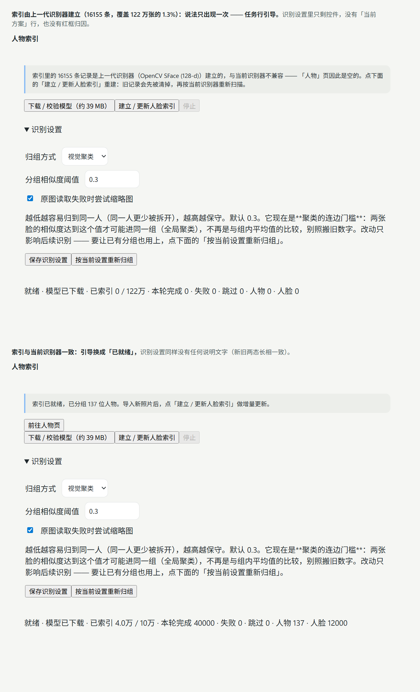

# 本地人脸识别与人物分组

实现日期：2026-09-27。

## 使用

1. 重启桌面应用，在左侧导航打开「人物」，主内容区显示人物分组。
2. 进入「设置 → 后台任务 → 人脸识别」，点击「下载 / 校验模型」，首次下载约 14 MB（官方整包 `buffalo_sc.zip`，解出需要的那个 onnx）。只在该操作中联网下载公开模型，照片、人脸特征和姓名不会上传。
3. 点击「建立 / 更新人脸索引」，后台逐张检测静态照片。可停止；已完成的记录保留，再次更新时跳过未变化的照片，包括没有检测到人脸的照片。**索引收尾会自动跑一次全局聚类**（见「模型与实现」），所以中途看到的临时分组数不作数。
4. 点击「刷新人物」，打开一个分组，在姓名输入框中填写名称并保存。
5. 合并：在分组详情填写另一张人物卡片上的编号 `#`，点击「合并整组」并确认。目标组的名称保留。
6. 纠正：在某张人脸卡片下填写目标人物编号，再点击「纠正分组」；编号留空则创建新组。只改变这一张人脸的归属，不移动或删除照片。
7. Web 端通过「人物」浏览人物分组及其照片；模型下载、索引和编辑只在桌面端提供。组列表每页 24 组、详情每页 48 张人脸，支持翻页。点击人脸打开原照片预览。

自动结果是待核对的人物分组，不会推断真实姓名。姓名由用户填写。双胞胎、侧脸、遮挡、年龄差异和低清晰度可能导致误分或漏检。

## 模型与实现

- [OpenCV YuNet](https://github.com/opencv/opencv_zoo/tree/main/models/face_detection_yunet) 负责检测与五点定位，使用 `face_detection_yunet_2023mar.onnx`，约 0.23 MB。
- [InsightFace](https://github.com/deepinsight/insightface) **buffalo_sc** 的 `w600k_mbf.onnx`（MobileFaceNet / WebFace600K）提取 **512 维**特征，约 13.0 MB。取代旧版 OpenCV SFace（128 维 / 38.7 MB）——同一份 112×112 对齐裁剪、唯一变量是识别器，真库配对级 AUC 0.807 → 0.880、EER 0.268 → 0.195、最优 F1 0.774 → 0.828。
- 模型下载走 InsightFace 官方 GitHub Release 的 `buffalo_sc.zip`（14.3 MB），**下整包后从 ZIP 中央目录里解出 `w600k_mbf.onnx`** —— 官方只发布整包，HF / 镜像站上的单文件直链实测全部 401 / 404。解压是自写的最小 ZIP 解析（store / deflate 两种条目），不引第三方解压库。下载后按已核验的 SHA-256 与长度校验、写临时文件再替换；每次加载仍检查哈希。
- **许可证要分清**：YuNet 为 MIT；InsightFace **代码是 MIT，但预训练权重明确限定「仅限非商业研究用途」**（README 原文：「available for non-commercial research purposes only」，手动与自动下载一律适用）。本应用当前是个人/研究用途，若转为商业发行，**必须**先替换该权重或向 `recognition-oss-pack@insightface.ai` 取得授权。两条许可证随包附带并在模型下载时复制到模型目录（`src/ai/licenses/`，其中 `InsightFace-models.txt` 写明了这条取舍）。
- 推理使用项目已有 `onnxruntime-node` CPU 后端，无新增推理依赖。检测输入为 640×640 补边图；在最多 1600 边长的旋转校正图片上进行五点对齐，再送入 112×112 识别器。
- **识别器的预处理必须跟着换**：InsightFace 是 `(x − 127.5) / 127.5` + RGB；旧版 SFace 是 `blobFromImage(scale = 1, swapRB = true)`（0–255 不除、也无均值）。只换模型不换这段，出来的向量等于随机数——`face-model.js` 的 `tensor()` 因此带 `mean` / `std` 参数，两个模型的调用点各传各的。
- **五点对齐走两遍**：第一遍在整帧 640 画布上定位，第二遍把每张脸周围 1.8× 的区域单独裁出来再塞进 640 画布复核，用复核结果做对齐。原因是 YuNet 的导出把输入边长写死成 640（放大画布会直接报维度错误），一张占画布 15% 宽的脸在模型眼里只有 96px，关键点必然带误差 —— 而 5 点相似变换对误差极敏感。实测把配对级 AUC 从 0.79–0.81 提到 0.87–0.90，见下一节。
- 检测阈值 0.9，NMS IoU 阈值 0.3。单图最多保留 50 张人脸；过小人脸会跳过。
- **视觉聚类的自动分组分两步**：索引过程中每张新脸先走一次**增量近似**（与该人物**代表集**——组内确定性均匀抽样至多 16 个成员——的余弦相似度**平均值**低于阈值就新建一个人物，顺序相关，只是过渡）；**索引收尾再跑一次全局聚类**（Chinese Whispers，见下节），把整库重排一遍，所以中途的临时归属不作数。同一张照片中的不同检测结果不参与同一组。
- 两种归组方式：「AI 与索引 → 人物索引」里的「归组方式」可选**视觉聚类**（默认，按人脸相似度）或**按文件夹**（一个文件夹一个人）。前者对任意目录结构都能用，但受模型能力限制；后者接近 100% 准确，前提是照片本来就按人分目录。取舍见下一节。
- 视觉聚类默认阈值 **0.30**（0.10–0.50，步长 0.01）。这个域是**配对级相似度**（Chinese Whispers 的连边门槛），与 v2 时代的「与组内抽样成员的平均相似度」不是同一个量纲；上限只到 0.50，因为再往上只剩下「同一人也要拆成碎片」。按文件夹默认层级 **1**（1–4，指根目录下第几层子目录）。都由实测确定，见后两节。
- **曾经还有一条「最佳候选比次佳高至少 0.05，否则新建一组」的规则，已删除**（v2 时代修的）：它与阈值自相矛盾——最佳分 0.9x 时也会分家，是「同一人被拆开」的首要原因。
- **代表脸不再是「每组最早的那张脸」**（v2 时代的修正，v3 的增量近似仍在用）：四种代表在同一份真实数据上实测过——质心与单链都会迅速塌成大组（把不同人并进来），而「最早那张」的锚点质量全凭运气，队首若是侧脸 / 闭眼 / 暗光，整组就再难接纳同一人的其他照片。现在用「组内固定抽样平均」。

## 归组方式：视觉聚类 / 按目录分域聚类 / 按文件夹

三条路解决的是同一个症状（同一人被拆开），性质不同，所以三个都留着。

**视觉聚类**（默认）按人脸特征向量分组，不依赖目录结构。它的上限由模型决定、不由参数决定：本库是重度修图的 cosplay，同一个人换假发 / 瞳色 / 角色之后，跨角色的特征相似度能掉到不同人的水平。以「有脸的编号目录 = 一个人」为标准答案实测（3501 张脸 / 6 个人）：

| | 同人（目录内） | 不同人（跨目录） |
| --- | --- | --- |
| 中位数 | 0.36 – 0.53 | 0.277 |
| p5 | 0.11 – 0.32 | 0.091 |
| p95 | 0.57 – 0.70 | 0.462 |

同一人的中位数与不同人的中位数几乎贴在一起 —— 所以**换任何阈值都是赔本买卖**：0.55 只捞回 18.8% 的同人对（误伤 0.6%），0.35 能捞回 71.2% 但误伤涨到 26.0%。视觉聚类的定位是「对任意目录结构都能用的兜底」，不是「准确分人」。

**按文件夹归组**直接采信用户自己的目录约定：同一层目录下的所有脸 = 同一个人，组名取目录名。它不比对特征，所以完全不受上面那条曲线限制 —— 在同一份数据上实测 6 组，**张数与标准答案逐组一致**。代价是它把这个约定当成**永远成立**：它**忽略「同一张照片里的两张脸不得同组」这条约束**（合照里的所有人会被并成一个），一个文件夹里若真有两个人也会并成一个，而且错得看不出来（人物页只显示「一个人 N 张」），只能靠单张搬动去救。

⚠️ **它在这份数据上的高准确率有样本选择的成分**：当前人脸索引的 16,155 张只落在 8 个编号目录上（`K:\COS\112`–`119`），`G:\T` 一张都没进；而全库有 32,233 个文件夹、每夹照片数中位数只有 15 张、最大的单夹有 3366 张（`G:\T\T504_20251112_3366P`），还有 `K:\COS\134AI绘画成品素材赏析` 这种素材包目录。这类目录里「一个文件夹 = 一个人」根本不成立，所以**索引铺开到这些目录之前，别把归组方式停在「按文件夹」**（索引收尾会自动按当前设置重算一次，会把错并一次性做大）。

**按目录分域聚类**是前两条之间的第三条路：**目录只当边界，特征负责判定**。同一个域里的脸才互相比较，跨域绝不合并 —— 于是：

- 目录就是一个人时，输出与「按文件夹」一致（连自动目录名都一样）；
- **一个目录里有多个人时自动拆开**（「按文件夹」做不到）。拆出来的组**不命名** —— 刻意不拿目录名去冒充，因为那时目录名已经不能代表单一身份了；
- 同一个人的照片散在多个目录时，在设置里把那几个**目录名写进同一行**（「域分组」，如 `116, 117`），它们就并进同一个域一起聚类。

「按文件夹」与「按目录分域聚类」**共用同一个层级设定**：判定键都是「根目录下第 1 层子目录」（设置里可调 1–4）。不按「照片所在目录」的理由是照片存放深度不一：`K:\COS\116\a.jpg` 与 `K:\COS\116\某个图包\b.jpg` 同时存在，而用户的意思都是「`K:\COS\116` 这一个人」；取根下第 1 层，两种深度都会正确落到 `K:\COS\116`。不在任何已登记根目录下的照片退化为「照片所在目录」（最保守：不会把无关目录合到一起）。层级选错的症状很好认：本库选成 2 时 6 个人会变成 222 组（v2 全量 3501 张脸离线复算；线上本体 775 张脸端到端是 176 组，两者口径不同、都会炸）。

### 多层目录：层级是「截断」而不是「下钻」

规则只有一条 —— **判定键 = 根目录下第 `depth` 层子目录**，取法是把「相对根目录的路径」截到前 `depth` 段（`relative.slice(0, min(depth, relative.length))`）。三条推论：

- **第 `depth` 层以下的更深子目录并回第 `depth` 层**。`K:\COS\116\某图包\深一层\c.jpg` 在层级 1 归 `116`、层级 2 归 `某图包`、层级 3 才单独成组 —— 深度只截到第 N 段，与再往下的东西无关。
- **层级不足时按实际层数封顶**，不会产生空键也不会丢照片。照片直接躺在根目录下（相对路径为空）→ 归到根目录本身，组名取根目录名（`K:\COS\d.jpg` → `COS`）。
- ⚠️ **调高层级不会把散放在上层目录里的照片挪进子目录**。层级 2 时 `K:\COS\116\a.jpg` 仍归 `K:\COS\116`，与 `K:\COS\116\张三`、`K:\COS\116\李四` 分成三组 —— 上层那组是「所有没进子目录的散图」的**残差**，里面若混了多个人（`scoped` 会按特征尽力拆，`folder` 会并成一个）。所以「调高层级」不是干净的拆分操作，是换个高度重新切一刀。

根目录匹配逐段不区分大小写，且**最长匹配的根优先**（登记了嵌套根时以更具体的那条为准）。

**为什么域内聚类反而比全局更准**（实测，同一批向量、同一套参数）：全局 CW @0.30 → 6 个人被切成 **11 组**、12 块碎片；分域后**每个域各自收敛成一个主簇**（1394 张脸的 116 也是 1 组），只剩零星 1 张脸的碎片。原因是域边界挡住了跨目录的竞争：全局图里 116 的脸有机会被 117 的簇投票吸走，而域内不存在别的目录来「抢」。

**端到端实测（线上本体 `FaceStore.regroup()`，真实 v3 向量 775 张脸 / 6 个编号目录）**：`folder` → 6 组、组名张数与标准答案逐组一致；`scoped @0.30` → 12 组，其中 `115 / 116 / 119` 三个域是干净的单簇（因此带目录名），`114 / 117 / 118` 被拆出 1–2 张脸的零碎小组（因此不命名）；`scoped @0.20` → 10 组。同设置重跑两次，**成员构成逐组一致**（幂等）。层级选错（2）时 6 个人变成 176 组，症状与 `folder` 一致。

⚠️ **这笔账要算清楚：在「目录本来就是一个人」的图上，`scoped` 比 `folder` 多出几个 1–2 张脸的碎片小组**（因为只要开始比对特征，CW 就会对模糊 / 侧脸产生这种零碎输出 —— 全局聚类同样有，`folder` 是唯一完全不比对特征、因此完全不含碎片的模式）。所以 `scoped` 不是 `folder` 的严格升级，而是**给「目录不等于人」的图库买的保险**：目录干净时它略吵，目录脏时它不会像 `folder` 那样把错并做得看不出来。用哪个取决于你的目录有多可信。

⚠️ **`scoped` 的阈值还没有单独标定**。域内图比整库小得多，连边密度随之变化，所以「0.30 是全局标定的最优」不能直接搬过来（同一份数据上 0.20 给出 10 组、0.30 给出 12 组）。目前沿用全局默认值；要定档得像 v3 那样在**多档库规模 + 多个域规模**上复验，不能只在一种图上挑一个好看的数字。

**圈多个目录成一个域是安全的**：域只是放宽「谁可以和谁比」，不是强制合并。实测把 114 与 115（两个不同的人）圈进同一域，仍然分成 150 + 145 两组；把 116 与 117 圈进同一域，也仍分成 1529 + 439 两组；在线上本体上把 116 与 117 圈成一个域，得到的簇数与「两个域各跑一次相加」相同 —— **圈域不会制造新的碎片**。反向的边界也钉着：不加 `domainGroups` 时，同一个人的两批照片放在两个目录里就是**两个人**（域边界是硬的）—— 要合并就圈进同一域，或者事后手工合并一次（合并后命名即成为锚点，重算不会再拆开）。

**锚点是域边界的例外**：用户**手工命名过**的组（`name <> '' AND name_source <> 'folder'`）在聚类里是锚点，标签固定、不参与投票。这种组若横跨两个域，它的脸**保持同一个人**、不被域拆开 —— 用户的劳动优先于域边界。所以域边界只约束**新一轮聚类**，不拆已命名的人。

域分组按**目录名**（叶子名，如 `116`）匹配，不是全路径。代价是**同名目录会撞在一起** —— 两个根下都有 `116` 时，写一行 `116` 会把它们都圈进同一个域；层级调到 2 之后叶子名变成子目录名（`张三`），不同父目录下的同名子目录同样会撞。好处是用户写的就是他在界面上看到的名字，不必去抄盘符与大小写。一行一个域，域内用逗号或空格分隔；只写一个名字等于自成一域（与不写等价），所以「想拆开」只要把同行的伙伴删掉即可。

## 对齐精度：同一人为什么会被判成两个人（勿归因到「模型在看发色」）

症状是「同一个人换了造型就被切开」。直觉上会归因成「模型在看发色 / 妆容 / 瞳色」，但那是**症状的比喻，不是原因**，按这个方向去优化会白费力气（见下面被否掉的几条）。逐项查下来的结论是：**对齐没对准**。

### 不是模型在看发色，而是 embedding 被对齐误差带偏了

先排除掉「白送的分」：预处理与 OpenCV 官方实现**逐项一致**——`blobFromImage` 的 `scale = 1`（输入 0–255，不除 255）、`swapRB = true`（模型吃 RGB）、无均值、112×112、同一份 5 点 ArcFace 模板（模板均值 `56.0262 / 71.9008` 与官方一致）、L2 归一后点积。所以问题不在输入格式。

再逐条测输入侧与聚合侧的改法（真库 6 个编号目录 = 6 个人，两批互不重叠的抽样，配对级 AUC 越接近 1 = 身份信号越强）：

| 改法 | 同人中位 | AUC | 结论 |
| --- | --- | --- | --- |
| 现行（从 1600 中间图裁剪） | 0.4153 | 0.7877 | 基线 |
| 从**原图全分辨率**裁剪 | 0.4033 | 0.7816 | **没有收益** —— 裁剪分辨率不是瓶颈 |
| 224→112 抗混叠降采样 | 0.4144 | 0.7868 | 无差别 |
| 水平翻转 TTA | 0.4111 | 0.7895 | 只有千分位 |

真正的差异出现在关键点上：**整帧 640 画布给的关键点与局部复核给的关键点，平均相差 4.9% / 5.2% 脸宽（P90 7.7% / 8.3%）**。5 点相似变换是拿这 5 个点去拟合的，点偏了整张 112×112 就跟着偏 —— 而 SFace 这类模型对对齐误差极其敏感，它对「同一个人的两张歪了的对齐图」给出的相似度，可能低于「两个不同人的两张正的对齐图」。这就是「同人不同造型被判成两个人」的真正来源。

### 复核怎么做，赚了多少

YuNet 的 ONNX 导出把输入边长**写死成 640**（`Got: 1600 Expected: 640`），所以放大检测画布这条路是堵死的。可行的做法是**级联**：用整帧结果当粗定位，把每张脸周围 1.8× 的区域单独裁出来再塞进 640 画布跑第二遍 —— 脸在画布里的占比从约 15% 升到约 55%，关键点精度随之上升。

| 变体 | 同人中位 | 跨人中位 | 间隔 | AUC | 最优 F1 |
| --- | --- | --- | --- | --- | --- |
| 第一批 83 张脸 · 现行 | 0.4353 | 0.2981 | 0.1372 | 0.7877 | 0.7457 |
| 第一批 · 局部复核 | 0.4734 | 0.3054 | 0.1680 | 0.8749 | 0.8000 |
| 第一批 · 复核 + 翻转 TTA | 0.4922 | 0.3130 | 0.1792 | 0.8926 | 0.8158 |
| 第二批 112 张脸 · 现行 | 0.4297 | 0.2856 | 0.1440 | 0.8060 | 0.7636 |
| 第二批 · 局部复核 | 0.4826 | 0.2979 | 0.1847 | **0.9017** | **0.8381** |
| 第二批 · 复核 + 翻转 TTA | 0.4996 | 0.3061 | 0.1935 | 0.9052 | 0.8389 |

两批互不重叠的抽样给出同一结论（AUC +0.09 左右），所以不是抽样噪声。用**线上模块本体**（`load()`，而不是探针里的复刻代码）跑第二批同一批照片得 AUC **0.8998** / F1 0.8399，与探针的 0.9017 / 0.8381 吻合 —— 复刻只能说明想法可行，跑本体才能说明提交的代码真的生效。

代价是每张脸多一次 640 画布推理，整条链路实测 **230 ms/脸**（含解码整图）。

### 实现里的三条约束（都有回归钉着）

- `REFINE_MARGIN = 1.8`：复核区域按脸周外扩的倍率。小了脸会贴边、大了等于没复核。
- **坐标要整张映、横纵各算各的**：粗定位给的是画布坐标，映回中间图时 `x / y / w / h / 关键点` 一个都不能漏；而且画布是按中间图长宽比字母框出来的，横纵比例一般不相等，用一个比例换算会把关键点整体拉偏。这两条都踩过：漏映 `x / y` 时复核区域裁到别处，一次丢掉 76/84 张脸。
- `REFINE_MAX_DRIFT = 0.75`：复核结果离粗定位中心超过 0.75 倍脸长就**不采纳**，保留粗定位关键点 —— 宁可对齐糙一点，也不要把对齐锚到旁边那个人脸上。

### 被否掉的几条（别再重复试）

- **换阈值**：不是参数问题。现行管线下同人中位 0.43 / 跨人 0.30，分布重叠得厉害。
- **换更强的模型**（**v3 已采纳**）：确实是最彻底的杠杆。当时没动的顾虑是**许可证** —— 旧版 SFace 是 Apache-2.0，而 InsightFace 的代码虽是 MIT、**预训练权重明确限定「非商业研究用途」**。用户明确要求按 LAP 的做法换 InsightFace 后，本轮换成了 `w600k_mbf`（512 维），并把取舍写进 `src/ai/licenses/InsightFace-models.txt`：**本应用作为个人 / 研究用途使用没问题；转为商业发行前必须替换该权重或取得授权**。同数据实测 AUC 0.807 → 0.880、「碎片」39 → 12，见 [`#v3`](#v3换识别器--换聚类算法为什么是-insightface--chinese-whispers)。
- **改聚合方式**：把「抽样 16 张取平均」换成「取最像的 8 张」「取 bbox 最大的 16 张」「全体平均」，在补上「同一张照片的两张脸不得同组」这条约束后重放整库 3501 张脸，最优 F1 分别是 0.819 / 0.831 / 0.700 / 0.817。看起来有收益的 top-8 其实是**刀尖上的过拟合** —— 它的最优恰好落在「刚好凑出 6 组」那个阈值上，阈值挪到 0.20 立刻塌到 0.524。**聚合侧没有可靠的提升空间。**
- **检出层加「质量过滤」再挑参考脸**：用 bbox 面积当质量代理本身就不可靠（`box` 是相对各自照片画布的归一化值，跨照片不可直接比），实测也是最差的一档。

⚠️ **下一节的数字是 v2 时代（SFace + 贪心聚类）测的：结论方向仍成立，具体数值已作废。** v2 → v3 变了两件事——识别器换成了 InsightFace（同人相似度整体改变），聚类从贪心换成了 Chinese Whispers（阈值量纲从「与组内抽样的平均相似度」变成「配对级连边门槛」）。所以**不要把下面任何一档阈值照搬到现役版本**；现行阈值与曲线见再下一节。

## v2 实测：0.20 的来历（SFace + 贪心聚类，数值已被 v3 取代）

依据：真实图库索引快照 **3501 张人脸 / 16155 张已扫描照片**（本机 `K:\COS`，cosplay 图库）。
标准答案：有脸的照片分布在 **6 个编号目录**（`K:\COS\114桃良阿宅`…`119`），按用户约定「编号目录 = 一个人」即 6 个人。
工具：`scripts/face-threshold-probe.js <faces.sqlite 副本>`，离线只读，可复现下表。

### 1. 症状：过度分裂

| 每人脸数 | 人数 | 占比 |
| --- | --- | --- |
| 1 张 | 1641 | 72.5% |
| 2 张 | 390 | 17.2% |
| 3 张及以上 | 231 | 10.2% |

**72.5% 的「人」只有一张脸**；**97.2% 的组都存在一个相似度 ≥ 0.55 的「邻组」**，最近邻中位数 0.765。
也就是说按算法自己的阈值，这 2262 个组里绝大多数早该并起来。最刺眼的一对是 `#1148 ↔ #1153 = 0.954`。

### 2. 根因一：`best - second < 0.05` 那条规则（不是阈值太高）

每个组「到最近的另一个组」的质心相似度分布：

| 最近邻相似度 | 组数 | 占比 |
| --- | --- | --- |
| ≥ 0.80 | 157 | 20.1% |
| 0.70–0.80 | 319 | 40.7% |
| 0.60–0.70 | 214 | 27.3% |
| 0.55–0.60 | 63 | 8.0% |
| < 0.55 | 30 | 3.8% |

**88.1% 的组，其最近邻组的相似度 ≥ 0.60** —— 也就是「按算法自己的阈值，它们本该已经合并」。
最刺眼的几对：`#400(4 脸) ↔ #403(4 脸) = 0.938`、`#703 ↔ #706 = 0.915`、`#607(3 脸) ↔ #612(4 脸) = 0.907`，
肉眼逐对核对（`--dump` 会导出联络图）全部是同一个人换了角度 / 表情 / 假发。

离线重放同一份数据（与线上 783 组逐值一致，确认重放可信）验证各改动单独的效果。
**下表是 1268 张脸时期的快照**（数据规模与上面不同，只用来说明「margin 才是首要原因」）：

| 改动 | 人物数 | 单脸组占比 |
| --- | --- | --- |
| 线上现状（阈值 0.60 + margin） | 783 | 70.0% |
| **只删掉 margin**（阈值不动） | **362** | 47.8% |
| 只把阈值降到 0.55（margin 不动） | 732 | 67.6% |
| 删 margin + 阈值 0.55（= 本版默认） | **229** | 32.3% |

只降阈值几乎没用（732），删掉那条规则才有用（362）——**它是首要原因**。

### 3. 根因二（也是上限所在）：代表脸用「最早那张」

同一份 1268 张脸数据、阈值 0.60、无 margin，四种代表的对比：

| 代表 | 人物数 | 最大一组 | 判定 |
| --- | --- | --- | --- |
| 全体成员取最大（单链） | 177 | 403 张 | 不可用：最大组里黑发 / 金发 / 蓝发不同的人混在一起 |
| 质心 | 210 | 124 张 | 不可用：组越大质心越「糊」，越接近所有人的平均 |
| medoid（组内最典型一张） | 337 | — | 与「最早那张脸」几乎等价，无额外收益 |
| 最早那张脸 | 362 | 49 张 | 当时采用：最保守 |

cosplay 图库同一人常换假发，组内本身离散，质心与单链都会迅速塌成大组并开始吞人。当时据此选了最保守的「最早那张脸」。

**但这个选择是错的**，错在把「锚点」托付给运气：队首若是侧脸 / 闭眼 / 暗光，整组就再难接纳同一人的其他照片。拿标准答案（6 个编号目录）一算：

| 代表策略 | 最优阈值 | 组数 | precision | recall | F1 |
| --- | --- | --- | --- | --- | --- |
| 最早那张脸（旧） | 0.28 | 24 | 0.741 | 0.484 | 0.586 |
| 最早那张脸（旧，硬压阈值） | 0.18 | 7 | 0.729 | 0.765 | 0.747 |
| **固定抽样平均（新）** | **0.20** | **10** | **0.806** | **0.777** | **0.791** |

换策略（不必动阈值）就把 F1 从 0.586 提到 0.791。旧策略即使把阈值压到 0.18 也只能到 F1 0.747，代价是 23% 的脸落进「非主体」组，即大量不同人混在一起。

现在的定义：**新脸与一个已有组的相似度 = 与组内确定性均匀抽样至多 16 个成员的平均相似度**。它既不像质心那样「糊」，也不像单链那样传染，更不受单个坏锚点支配。

### 4. 阈值：0.20（以及上一版为什么定错了）

**量纲变了，两档数字不可互抄。** 旧版比的是「与组内第一张脸的相似度」，新版比的是「与组内抽样成员的**平均**相似度」，后者天然更低。旧版的 0.55 在新量纲下约等于「几乎不合并」，所以磁盘上没有 `version` 字段的老 `settings.json` 会被迁移成新默认值，而不是沿用旧数字。

新量纲、固定抽样、细网格实测：

| 阈值 | 组数 | precision | recall | F1 |
| --- | --- | --- | --- | --- |
| 0.18 | 7 | 0.729 | 0.765 | 0.747 |
| 0.19 | 8 | 0.791 | 0.795 | 0.793 |
| **0.20** | **10** | **0.806** | **0.777** | **0.791** |
| 0.21 | 10 | 0.806 | 0.777 | 0.791 |
| 0.22 | 11 | 0.866 | 0.776 | 0.819 |
| 0.25 | 17 | 0.845 | 0.604 | 0.704 |
| 0.30 | 26 | 0.940 | 0.582 | 0.719 |

取 **0.20**：它处在 0.20–0.21 的稳定平台上（两档给出完全相同的分组），精确率与召回率均衡。0.22 的 F1 略高但已逼近陡坡。

**上一版那段「0.55 的来历」是循环论证，别照着调参。** 它只挑「已经被并到 ≥ 0.55 的组对」来肉眼分档，等于只看最像的那一批，自然得出「0.60–0.70 全是同一人」的结论，再据此声称「0.45 是不该再低的下限」。拿标准答案一算，0.55 下同人召回只有 18.8%。

**以后的规矩**：给阈值定档一律用「有脸的编号目录 = 一个人」这类**外部标准答案**算 precision / recall，不要再用「看着像」。肉眼分档只能用来做定性判断（比如「这一档里有没有明显不同的人」），不能用来定数。

### 5. 抽样必须是固定个数

`step = floor(len / 16)` 步进会让抽样个数随组大小抖动，阈值曲线随之剧烈跳变 —— 同一份数据上 0.22→0.26 之间 F1 从 0.838 掉到 0.656 再弹回 0.799，用户改 0.01 结果剧变。改成固定取 16 个（`floor(k * len / 16)`）后整段曲线平滑：0.19–0.30 之间 F1 稳定在 0.70–0.82。

**改动抽样方式或代表集上限（16）时必须重跑标定**，否则上面那张表作废。

### 6. 让已有索引用上新设置：重新归组

阈值改了、规则修了、归组方式换了，**已有分组都不会自动变**。两条路：

1. 「人物索引 → 按当前设置重新归组」：用已落库的人脸特征重跑分组，**不重跑模型**。真库 3501 张脸实测：视觉聚类 829 ms、按文件夹 110 ms、经 Worker 端到端 401 ms。
   - **已命名的人物是锚点**（视觉聚类下），成员原地保留，命名与手工整理不会被冲掉。
   - 按文件夹归组时，用户**手工命名**过的组如果超过一半成员落进同一个新目录组，名字会被继承过去；上一轮自动起的目录名则不算用户劳动，切回视觉聚类时整批清空（否则上千个自动名会被当成锚点锁死，视觉聚类等于没跑）。
   - 同一设置重跑结果幂等（分组本身不变）。
2. 删掉 `faces.sqlite` 重新索引：结果与 1 等价，但要重跑一遍 CNN。

## v3：换识别器 + 换聚类算法（为什么是 InsightFace + Chinese Whispers）

起因是用户的两条指令：**「能增强人脸特征，而不是发色等其他特征」**、**「使用 InsightFace，参考 [julyx10/lap](https://github.com/julyx10/lap) 的做法」**。lap 是 Rust + Tauri 的离线优先照片管理器，它的实现读得很清楚（`src-tauri/src/t_face.rs` / `t_cluster.rs` / `t_common.rs`）。

### 1. 只换识别器：检测侧保留 YuNet + 两遍复核

lap 用的是 InsightFace **buffalo_sc** 包：`det_500m.onnx`（SCRFD-500M 检测，2.5 MB）+ `w600k_mbf.onnx`（MobileFaceNet / WebFace600K，512 维，13.6 MB）。它**不用 buffalo_l**（166 MB + 同样是「非商业研究」权重）。

检测侧**不换**：`det_500m` 同样把输入边长写死成 640（给 320 会报 `Expected shape from model of {800,10} does not match actual shape of {200,10}`），所以上一节的「两遍局部复核」照样需要，而 SCRFD 相对 YuNet 在本库没有可测的增益、还多 2.4 MB。

**隔离实验**：同一份 112×112 对齐裁剪、唯一变量是识别器，真库 3501 张脸：

| 识别器 | 维度 | 同人中位 | 跨人中位 | 间隔 | AUC | EER | 最优 F1 | 阈值 |
| --- | --- | --- | --- | --- | --- | --- | --- | --- |
| SFace（旧） | 128 | 0.4220 | 0.2673 | 0.1547 | 0.8073 | 0.2675 | 0.7742 | 0.2868 |
| **w600k_mbf（新）** | **512** | 0.3893 | **0.1936** | **0.1957** | **0.8801** | **0.1948** | **0.8284** | 0.2599 |

关键在于**同人中位反降、跨人中位降得更多**，间隔从 0.155 拉到 0.196 —— 这才是「分得开」的原因。也正因为同人相似度整体更低，**阈值数字不可照搬**。

### 2. 换聚类：Chinese Whispers，但参数不照抄

lap 用 **Chinese Whispers**（K-NN 图 + Top-K 剪枝 + 边权 = 相似度² + 最多 20 轮随机顺序加权投票 + **同一张照片的两张脸不连边**）。采纳结构，参数重标：

| K_NEIGHBORS | 结果（8 个随机种子的 F1 均值） |
| --- | --- |
| 80（lap 原值） | 0.778，种子间 0.666–0.856；阈值 0.20–0.40 之间结果**逐位不动** |
| **400（采纳）** | 0.879–0.948，种子间 0.90–0.95 |
| 800 | 低阈值时整库塌成 1 组（阈值 0.30 时 precision 只有 0.255） |

K 太小图被剪断、结果对访问顺序过度敏感；K 太大又连边过量、一松阈值就全塌。取 **400**。边权保持**平方**（相似度¹ 的种子均值是 0.915 且更不稳，平方是 0.935）。

**固定种子 `CW_SEED = 20260929`**：Chinese Whispers 天然是随机顺序投票，不固定种子「同一设置重跑」会给出不同分组。

### 3. 新的判据：「一个人被切成几块」

配对级 F1 会被最大的真值组淹没 —— `116`（1394 张脸）就算被切成 20 块，同人配对的召回率也还有 0.74，F1 照样好看。**而用户抱怨的正是「同一个人被分成不同人」。** 所以增加一个直判：对每个真值人，数他散落在多少个预测簇里（含 ≥1% 其成员的簇才算一块）。

真库 3501 张脸 / 6 个人，同一套判据：

| 管线 | 组数 | P | R | F1 | 每个人被切成几块 | 合计 |
| --- | --- | --- | --- | --- | --- | --- |
| v2 · 贪心 + SFace（@0.22，当时最优） | 12 | 0.882 | 0.761 | 0.817 | 7/6/3/8/8/7 | **39** |
| v2 · 贪心 + w600k_mbf（@0.16） | 15 | 0.891 | 0.868 | 0.880 | 4/4/2/5/5/3 | 23 |
| **v3 · CW K=400（@0.30，默认）** | **11** | 0.844 | 0.893 | 0.868（均值 0.883） | 2/3/1/2/2/2 | **12** |
| v3 · CW K=400（@0.45） | 55 | 0.957 | 0.901 | 0.928（均值 0.948） | 3/3/1/1/2/4 | 14 |

### 4. 阈值 0.30：为什么不是 F1 最高的 0.45，也不是整库最优的 0.20

**首先，阈值不能在单一库规模上定档。** Chinese Whispers 的连边密度随库的大小变化（n 小时 Top-K 剪枝不起作用、图更密），最优阈值会漂。所以除了整库（3501 张脸）还用**线上模块本体**在 **124 张脸**与 **250 张脸**上各复验了一遍：

| 阈值 | 整库 3501 张 | 250 张 | 124 张 |
| --- | --- | --- | --- |
| 0.20 | 7 组 · 12 块 · 0.879 | **塌成 2 组（P 0.21）** | 塌成 2 组 |
| 0.25 | 7 组 · 12 块 · 0.881 | 4 组（P 0.23）· 0.376 | — |
| **0.30** | **11 组 · 12 块 · 0.883** | **8 组 · 13 块 · 0.704** | **6 组 · 9 块 · 0.817** |
| 0.35 | 17 组 · 13 块 · 0.901 | 8 组 · 12 块 · 0.674 | — |
| 0.40 | 28 组 · 14 块 · 0.935 | 13 组 · 15 块 · 0.902 | 14 组 · 14 块 · 0.885 |
| 0.45 | 55 组 · 14 块 · 0.948 | 20 组 · 21 块 · 0.923 | — |

（「块」= 每个真值人散落在多少个预测簇里，≥1% 成员才算一块；真值是 6 个人。）

- **0.20 在整库上是 0.879、只要 7 组，看起来最漂亮 —— 但小库上会整库塌成 2 组。** 阈值不能只在一种规模上成立，新用户装的库可能只有几百张脸。
- **0.45 的 F1 最高（整库均值 0.948），但它会给出约 55 个「人物」**（真值 6 个），其中 41 个是不到某个人 1% 的小碎片。
- **只有 0.30 在三档规模上的组数都贴近真值**（11 / 8 / 6 组，真值 6），碎片数也稳定在 9–13 块。「组数」是用户直接看到的数字，「碎片数」是他抱怨的症状 —— 两者都指向 0.30。
- 再配合既有的取舍原则：**并错人是一次可见、一键可拆的错误；凭空多出一个人则会自我繁殖**（用户每看到一个陌生人物就要判断一次，它还会继续吸走新脸）。宁可少分不乱分。想更保守的可以自己往上拧（上限 0.50）。

### 5. 索引分两步：增量近似 + 收尾全局聚类

`put()` 过程中给的是**增量近似**（边扫边并入最像的一组，顺序相关、看不到全局结构）：同一份数据它要把阈值拧到 0.16 才有 0.880。所以 `face-worker.js` 在索引循环结束后**自动跑一次 `regroup()`**（与 lap 的「先扫脸、最后整体聚类」一致），并把 `clustered` 一起回报。规模上限 **`AUTO_REGROUP_LIMIT = 8000` 张脸**（建图是 O(n²)，3501 张约 10 秒），超限跳过自动那一次、用户仍可手动「按当前设置重新归组」。

### 6. 三处必须一起改，漏一处就出错

1. **向量维度 128 → 512、打包字节 512 → 2048**。`unpack()` **严格要求 2048 字节**：旧 SFace 的 512 字节一律抛 `FACE_VECTOR_INVALID` —— 硬解会把 128 个 float 当 512 个读，一路算到 NaN 相似度，而在归组结果上完全看不出来。
2. **预处理换成 `(x − 127.5) / 127.5` + RGB**（InsightFace 口径），与 SFace 的 `scale = 1` + `swapRB` 不同。
3. **`VERSION` 升到 `yunet2023-insightface-w600kmbf-align112-refine-v3`**：`regroupByCluster` / `regroupByFolder` 的 SQL 都加 `JOIN scans s … AND s.version = ?`，索引开始前新增 `purgeStale()` 清掉非当前版本的 `scans`（`faces` 由外键 CASCADE 带走）。不这么做，旧向量会与新向量混算相似度。

**已有索引需要全库重跑**（旧记录会被 `purgeStale()` 清掉），实测约 **230 ms/张 ≈ 13 分钟**。

### 7. 换识别器之后：旧索引是「被过滤掉」而不是「消失」，界面必须说出来

`VERSION` 一升，上一代记录**一张都不会被删**，但所有读路径都过 `VALID` 那道 `s.version = ?`，于是 `faces` / `people` / `indexed` 一起归零。危险的地方在于：**这与「从来没建过索引」在数字上完全一样**，界面原先也只会说一句「还没有建立索引」。

真实踩过的形态（本机数据）：`scans` 里**16155 行 100% 是 `yunet2023-sface2021-align112-v1`**、`faces` 里 **3501 行向量全是 512 字节**（= 128 维 SFace）、`people` 2262 行，而 `status` 报的是 `{faces: 0, people: 0, indexed: 0}`、`groups` 返回 `[]`。用户看到的只有「人物索引全空了」—— 库里一条没少，但界面上没有任何东西能把「需要重建」和「从没建过」分开。

**所以 `summary()` 必须带上归因，而不只是三个计数**：

- `recognizer` / `version` —— 现役方案名与 `VERSION` 原文（`labelForVersion` 也会用它把旧代次翻成人话）。
- `staleScans` / `staleVersions` —— 读路径不采纳的旧记录条数与分组。每项带 `label`（`labelForVersion` 把已知的 `VERSION` 翻成人话，**认不出来就回落版本原文**，宁可丑也不猜错一代）。
- `library` —— 全库照片总数，覆盖率的**分母**。只报「已索引 0」看不出索引根本没铺开；本机真实比例是 16155 / 1224615 = **1.3%**。

**说出来，但只说一遍。** 这件事由两处承担：

| 位置 | 说什么 | 依据 |
| --- | --- | --- |
| 任务行引导（设置 → 后台任务 → 人物索引，紧挨按钮） | 上一代识别器建的、**与当前不兼容**、下一步**重建**（旧记录会先清掉） | `staleScans > 0` 且没有可用人物 |
| 人物页空态 / 状态行 | 同一判据的简版：指向「重建」，而不是「还没有识别到人物」 | `staleScans` / `staleVersions` |

⚠️ **「识别设置」里不放任何说明文字。** 早先在那里并排放过一行「当前方案：`YuNet + InsightFace w600k_mbf …`」和一行红框归因（「索引里的 16155 条记录由 OpenCV SFace (128-d) 建立 —— 这就是『人物』页为空的原因」）。截图一看就露馅：**同一块面板里，上方引导句已经把「上一代识别器 + 人物页为空」说了，下面红框几乎是同一句话再说一遍**，还把表单（归组方式 / 阈值）整个推下去。现已连同 `.people-scheme` / `.people-stale-note` 两个类一起删除，`people-page-regression` 里加了静态守护（`people.js` / `people.css` 都不得再出现这两个类名），防止它被「顺手加回来」。



上图是实际渲染（浅色）：上半是过期态、下半是健康态。注意**两块面板长得一样高**（都是 327 px），差别只在引导句 —— 「识别设置」里没有多出任何东西。[深色版本](assets/people-index-version-mismatch-dark.png)只换主题、结构相同。

⚠️ **代价与顺序**：`purgeStale()` 在**索引开始前**执行，所以点下重建的那一刻旧记录就没了，然后才开始按新识别器重扫。索引只覆盖 1.3% 的库时，「重建」是一次几十分钟到几天的承诺，中途取消等于旧数据已清、新的也没建完 —— 界面的措辞必须让用户知道这一点，而不是只给一个按钮。

## 数据与运行范围

数据位于应用用户目录的 `face-index/`：`models/` 保存模型，`faces.sqlite` 保存检测记录、人脸特征、对齐缩略图、分组和姓名。原始图库使用只读连接，不改变照片文件，也不迁移图库原表。该目录包含用户的人物组织信息，备份时应与图库数据库一起保存。

模型下载与索引需手动启动。推理、分组和数据库操作均在专用 Worker 中；普通图库浏览仍可继续。人脸任务与语义搜图的重任务互斥。**索引运行期间，人物页的只读查询（分组列表、人物照片、识别设置）会并发执行**：数据库为 WAL 模式，读连接独立于索引写入连接，人物页因此能在索引未完成时显示已识别结果并随进度自动更新。写操作（命名、合并、纠正分组）仍需等任务结束，点击时会排队并在任务结束后自动继续；其余互斥的重任务（语义搜图索引）仍会提示忙碌。

**随包内置模型**：安装包可以自带这套权重，用户就不必先点一次「下载模型」——`npm run bundle-models` 把检测器与识别器（`yunet.onnx`、`w600k_mbf.onnx`，连同两条许可证，共约 13 MiB；**不含上一代的 `sface.onnx`**）写进仓库根的 `models/face/`，`scripts/after-pack.js` 再整体复制进 `resources/models`；运行时由 `src/ai/bundled-models.js` 播种到 `face-index/models/`，触发点是状态查询前的准备钩子（桌面端与网页端共用，每进程一次）。这一侧**不做哈希判定**：播种只负责「缺了才补、尺寸不对才换」，**能不能用仍由 face worker 的 `verify()` 按 `FILES` 里的 sha256 说了算** —— 于是「只装了上一代 SFace 的目录」也能就地补齐升级，而复制坏掉时状态会诚实地停在「未就绪」，用户仍可点下载自救。许可仍随包附带（`src/ai/licenses/`，`InsightFace-models.txt` 写明预训练权重仅限非商业研究用途），因此 `models/` 不进版本库。

索引以照片 ID、路径、大小、修改时间及模型版本判断有效性。修改或删除的照片会从人物浏览中排除。外部改动后应先扫描图库，再更新人脸索引。重新处理发生变化的照片会重新生成其人脸记录，该照片原有的手动归属可能需要再次核对；未变化照片的姓名和分组编辑会保留。

优先读取原文件；无法处理时尝试现有缩略图，因此 RAW 支持及小人脸召回受到解码器、缩略图尺寸的限制。失败计数会显示在面板中。停止在下载或图片/人脸处理边界响应，正在运行的原生推理可能需要完成后才能停止。

当前代表向量载入内存，匹配开销随人物组数增加；尚未验证超大人物库吞吐，也没有实现近似最近邻索引、自动清理失效人脸记录或视频人脸跟踪。

## 验证

- 普通回归：`node scripts/run-regressions.js`，新增人脸对齐变换、自动分组、命名持久化、拆分、合并、无脸增量跳过、修改/删除过滤、分页、参数校验和任务互斥检查；另有分组规则的三条「有牙齿」断言（用独立索引库，互不干扰）：
  - **歧义不得凭空新建人物**：最佳 0.35 / 次佳 0.34（均 ≥ 阈值）时必须并进相似度更高的那一组（把 `best - second < 0.05` 注入回去，这条会精确失败）。
  - **重新归组**：同阈值重跑按「成员构成签名」断言幂等（不看人数——人数相同但成员换组也算变）；放宽阈值后必须合并；空库重跑返回全零、不凭空造人物。
  - **命名人物是锚点**：给两组都命名后把阈值放宽到 0.10，分组签名必须一个都不动；把名字去掉后同样的重跑则必须合并成一。
  - **Chinese Whispers 本体**（v3 新增）：同一张照片的两张脸向量完全相同也不许并成一组；固定种子下同一份输入必须**逐位相同**；锚点标签固定为 `-(person_id + 1)` 且能把够相似的自由脸吸过去、对不像的脸没有影响；阈值收紧后组数不得减少；`K_NEIGHBORS` 必须停在实测过的区间（200–600，挡住「抄回 lap 的 80」与「放大到 800 会塌库」两个方向）。
  - **模型与存储**（v3 新增）：`VECTOR_DIM === 512` / `PACK_BYTES === 2048`；`unpack(512 字节)` 与 `pack(128 维)` 都必须抛错；pack → unpack 往返一致；`readZipEntry` 用**自造 ZIP 夹具**（同时含 store 与 deflate 两种条目）验证正解，并覆盖 `ARCHIVE_ENTRY`（条目不存在）与 `ARCHIVE_INVALID`（不是 ZIP）两条错路。
  - **按目录分域聚类**（v3 后续新增）：用一张 13 张照片的夹具钉四条契约 —— ①增量阶段（`put()`）就不得跨域合并（否则索引中途的人物数就是错的，这条**只有**在收尾重算之外单独断言才抓得到）；②一个目录里两个人必须拆开（`A=3` 是错的，得是 `2+1`）；③「单目录 + 只聚出一个簇」才沿用目录名，聚出多个时**不得**拿目录名冒充；④手工命名的组是锚点，去掉域分组后仍不被域边界拆开、名字也保留。另有域分组文本的规范化断言（保留原大小写与顺序、只去空行与首尾空白）与三处静态防线（`GROUPINGS` 三值、下拉三值、`people.js` 与设置源两处镜像比对）。
  - **索引与识别器版本不匹配**（本轮新增）：在索引库里插入两条**指纹三项（路径/大小/修改时间）完全正确、只有 `version` 不同**的 `scans`（一条是认得出的旧版本、一条是认不出的），断言 `indexed` / `faces` 都是 0、`staleScans = 2`、`staleVersions` 带人话标签且**认不出的那条回落版本原文**、`library` 仍是全库数；再断言 `purgeStale()` 把它们清干净、清理后 `staleScans` 归零。`summary()` 的形状用 `expectSummary()` **整对象比对**（不是挑字段），所以给 `summary()` 加字段必须手改断言，不会悄悄漏出去 —— 这几格正是「人物页为什么是空的」的全部依据。
  - **归因不能被含糊话术顶掉**（本轮新增）：`people-page-regression` 灌一份 `staleScans = 16155` 的状态，断言引导行说「上一代识别器」（`OpenCV SFace`）、点明「不兼容」、并给出下一步「重建」，覆盖率写成「已索引 0 / 122万」；同时断言**「识别设置」里不存在任何说明行**（`people-scheme` / `people-stale-note` 都不得出现）—— 健康状态下同样不得出现，避免新旧两态长得不一样；空列表态则断言话术是「上一代识别器」而不是「还没有识别到人物」。最后是两条**静态守护**：`people.js` 与 `people.css` 里都不得再出现 `people-scheme` / `people-stale-note` 这两个类名（那两个类已删，残留的样式会成为「加回去很容易」的邀请）。`ai-sidebar-regression` 对渲染端的状态行与空态下同一组断言。
  - 另有两处静态防线：阈值取值域在 `src/ai/face-settings.js`（唯一真相源）与浏览器侧镜像之间逐项比对；`face-store.js` **剥掉注释后**不得再出现 `second`（防 margin 规则复活）。
- 阈值实测工具：`scripts/face-threshold-probe.js <faces.sqlite 副本> [--calibrate [阈值列表] [层级]] [--dump <目录>] [--result <mode> <阈值>] [--band <下界> <上界>]`，只读离线，可复现本文档的数字与联络图。**`--calibrate` 的现役那一行直接引 `src/ai/face-cluster.js` 的 `chineseWhispers`（打印为 `cw K=400`）**，不是探针里另写一份 —— 复刻会漂移。`average` / `seed` 是 v2 与更早的历史对照。⚠️ 它也会提示库里的向量维度：**阈值不能跨识别器照搬**（SFace 128 维的余弦整体偏高，用现役的 0.20 跑会把所有人并成一团）。
- 模型实测：`scripts/face-model-smoke.js <模型目录> <公开样例照片> --other <第二张样例照片>`。使用 OpenCV 官方样例；同一张脸经缩放与亮度变化后应被判为同一人、另一人物样例不得被合并、空白图片不得检出人脸。⚠️ 报出的**相似度绝对值随识别器变化**（v2 的 SFace 是 0.977 那一档，v3 的 w600k_mbf 同人相似度整体更低），所以只按「相对关系」判读，不要把具体数字当阈值参考。
- Electron Worker 实测：`scripts/face-service-smoke.js <模型目录> <样例照片>`，验证离线检测、分组、增量跳过、命名、拆分、合并及删除过滤。需用 Electron 的 Node 模式运行以匹配 SQLite 原生模块。
- 索引实时性实测：`scripts/face-live-index-smoke.js <模型目录> <人脸照片A> [人脸照片B] [照片数]`，用真实模型跑一次索引并断言三点：索引结束前进度里已上报过「人物数 > 0」（人物页据此增量刷新）、同样在结束前上报过「已扫描 / 已检出人脸」（人物页实时读数把三者分格显示成「已扫描 / 检出人脸 / 人物」，用户据此区分「在跑但没检出脸」与「在跑、正在冒出人物」）、索引运行期间并发 `groups` 不被 `AI_BUSY` 拒绝且返回已识别分组。实测 24 张样例图：人物数 / 检出人脸 / 已扫描各上报 45 次，并发只读返回 2 组。
- 注意：上述 smoke 脚本用 junction/符号链接指向模型目录，清理临时目录前必须先 `unlink` 该链接。Windows 上直接 `rmSync(recursive)` 会顺着链接删掉真实模型文件。
- 测试仅使用临时数据库与公开样例，没有读取或索引用户图库。真实 UI 截图、触摸交互、打包后运行及复杂人物图库准确率尚未验收；此前的本地预览安全限制未被绕过。

## 索引流程与识别设置

人脸模型下载和索引已接入顶部统一后台任务面板，沿用扫描、缩略图和重复索引的折叠与轮询机制。各页面均可查看本轮完成、失败、跳过数量、当前文件和平均处理速度，也可直接停止或进入设置。速度按本轮完成及失败图片的累计耗时计算，不代表剩余时间预测。模型下载显示当前模型文件百分比；索引使用活动进度条，不预先全库计数。任务结束后与其他任务一样从全局面板隐藏，最终统计或错误保留在「设置 → 人脸识别」。没有新增暂停按钮；停止后可从设置继续增量更新。

桌面端的模型下载、索引控制、进度和识别参数统一位于「设置 → 人脸识别」。人物页只浏览和管理分组，并提供跳转到设置的快捷入口。人物详情在主内容区展示，点击「全部人物」返回；切换导航保留当前人物、分页和页面滚动位置。Web 端保留原有弹窗入口。
先添加并扫描照片目录，确认模型就绪后点击「建立 / 更新人脸索引」。窗口显示处理、失败、跳过数量，任务结束后自动刷新人物列表。处理总量没有预先扫描，因此索引阶段显示活动进度条，不显示估算百分比。

关闭人物窗口不会停止后台索引。「停止」保留已完成结果；再次更新仅处理新增、变化或之前失败的照片。失败照片可在恢复原图访问后重试。视频等不支持类型会跳过。

索引过程中人物栏上方会显示「索引处理中，以下为目前已识别的结果，会随进度自动更新」。人数变化由索引进度事件驱动（每批上报一次人物总数，节流 1.5 秒），页面按下一次状态轮询（3 秒）增量拉取，因此新分组最迟约 3 秒后出现，无需等索引跑完。此时尚未识别出任何人物则显示「索引处理中，完成后自动显示人物」。两种提示都使用整行文案布局（`.people-message` / `.people-live`），不参与人物卡片的网格列，避免被 160px 列宽压成逐字换行。

在「设置 → AI 与索引 → 人物索引」里可以直接改这些识别参数（**2026-10-05 起不再折叠成一枚 `<details>` 入口**，设置项直接铺开；原先折起来是因为这一块挤在「后台任务」清单里当一行用）：分组相似度阈值（数值输入，默认 **0.30**，范围 **0.10–0.50** 步长 0.01）、归组方式（视觉聚类 / 按目录分域聚类 / 按文件夹）、文件夹层级、域分组文本框、原图失败时的缩略图回退选项，以及「按当前设置重新归组」。三种归组方式各自只需要其中一部分输入，切换时不适用的那些会收起来。阈值改动只影响后续识别；要让已有分组也生效，点「重新归组」（不重跑模型，命名过的人物保留）。设置保存在人脸索引目录的 `settings.json`；老版本留下的 `{ grouping: 'balanced' | 'strict' }` 与**旧量纲**的阈值都会按 `version` 字段自动迁移，不会照搬旧数字（照搬约等于「几乎不合并」）。任务期间不能修改设置。Web 端仅浏览状态和人物（归组方式的下拉只在桌面端，网页端没有这个入口）。

### 索引期间「人物」数只数还有当前版本人脸的人（勿回退）

实时条上「人物」那一格取自 `FaceStore.counts().people`。它**不能**是
`SELECT COUNT(*) FROM people`：`purgeStale()` 在索引开始前只删 `scans`（`faces` 靠外键
`ON DELETE CASCADE` 跟着走），**清不掉「人脸已经没了」的空组** —— 真正清空组的是收尾
`regroup()` 里的 `DELETE FROM people WHERE id NOT IN (SELECT person_id FROM faces)`，
而全库规模下收尾聚类会被 `AUTO_REGROUP_LIMIT`(8000) **跳过**。

生产库实测：换 v3 重建时 `people` 里留着上一代 **2273** 行，而当时真实人物只有 **11** ——
实时条读作「处理 179 · 跳过 218 · 人物 **2273** · 人脸 274」。旁边「已扫描 / 人脸」都在涨，
只有「人物」纹丝不动，看起来像坏了；用户盯几天也看不出人物在增长。

所以它改成只数**还有当前版本人脸**的人：

```sql
SELECT COUNT(DISTINCT f.person_id) FROM faces f
JOIN scans s ON s.photo_id = f.photo_id WHERE s.version = ?
```

刻意**只按 `version` 过滤、不回 `photos` 校验指纹**：这条路每 1.5 秒跑一次，`VALID` 那套
三表 join 在大库上是几十到几百毫秒，塞进心跳会跟索引 worker 抢写锁；指纹漂移的照片本来
就会被 `batch()` 重扫，不差这一会儿。权威数字仍以 `summary()`（走完整 `VALID`）为准。
`counts().faces` / `counts().scanned` 保持原样 —— `faces` 还兼着收尾聚类的准入判断。

守护：`face-regression` 造「一个空组 + 一个有效组」，断言 `COUNT(*) FROM people === 2`
而 `counts().people === 1`。

### 全库重建怎么跑（122 万张 ≈ 4.5–5 天）

应用里**没有**「自动建索引」这条路径 —— 磁盘 `settings.json` 里的 `faceAutoScanOnStartup`
与 `faceClusterThreshold` 都是**死键**（`main.js` 里一处都没读），建索引只能靠人在
「AI 与索引 → 人物索引」点按钮。全库 1,224,615 张没人守得住，所以有 `scripts/face-index-full.js`：

```bash
ELECTRON_RUN_AS_NODE=1 node_modules/electron/dist/electron.exe \
  scripts/face-index-full.js --heartbeat 60
```

它走与点按钮**完全相同**的链路（`FaceService → src/workers/face-worker.js → FaceStore`），
只是不建窗口、不装 `canRun` 闸门。`ELECTRON_RUN_AS_NODE=1` 是必须的：整条链路
（含 `face-model` / `logger`）**没有一处 `require('electron')`**，根本不需要 Browser 进程；
而直接 `electron script.js` 会反复报 `GPU process exited unexpectedly`，并**偶发**
`FATAL: GPU process isn't usable. Goodbye.` 把整个进程带走（exit 3，日志只留 header）。
参数：`--minutes N`（到点自动取消）、`--db` / `--index` / `--log` / `--heartbeat`。

**实测代价**（生产库 1,224,615 张 / `photos.db` 12.97 GB）：

| 项 | 实测 |
| --- | --- |
| 速度 | 170–186 张/分钟 ≈ 2.9 张/秒 ≈ **460 ms/张** |
| 全库耗时 | **4.5–5 天**（上限；非图片文件是 skip，几乎免费） |
| 索引体积 | ≈ **520 MB**（scans ~196 MB + faces ~220 MB，含开销） |
| 收尾聚类 | **跳过** —— 预计约 4.3 万张脸 ≫ `AUTO_REGROUP_LIMIT`=8000，人物划分 = 索引期间增量分组 |

**随时可中断、重跑自动续跑**：`scans` 行逐张提交，`batch(after)` 按 `photo_id` 升序跳过
已扫过的行，所以不需要任何断点文件。备份请用 `VACUUM INTO` 生成单文件快照，**不要 `cp`** ——
直接拷 `.sqlite` 会漏掉 `-wal`，拿缺 WAL 的库回滚会得到「少了一截」的索引。

⚠️ 跑之前确认应用没有在同时索引：两条写路径会争 `faces.sqlite` 的写锁。

### 索引实时读数契约（勿回退）

索引运行期间，人物页侧栏顶部显示一张读数卡片（桌面 `#aiPeopleLive`，网页 `.ai-web-live-bar`），
形态是**标题一行 + 三个数字一栏**：

- 标题行：脉动点 + 「正在识别人脸」，只有状态、不带数字。
- 数字栏：三格等宽，每格大号数字在上、小号标签在下 —— 「已扫描 / 检出人脸 / 人物」。

三条约束，各有回归钉住（桌面 `scripts/ai-sidebar-regression.js`，网页
`scripts/ai-web-views-regression.js`）：

1. **不许退回「胶囊 + 一整句」**。侧栏最窄 200px（可拖），一句话必然折行，`border-radius: 999px`
   的胶囊折行后成了两头极圆的两行块；而且折行处会把「检出」按 `overflow-wrap: anywhere`
   拆成「检 / 出」两半，第二行行首还会挂一个孤零零的「·」分隔符。数字各占一格靠布局分隔，
   这两种坏形态都不可能再出现。
2. **指标缺数据时整格藏起来，不显示占位符**。老 worker 不上报 `faces` 就藏掉那一格；
   数字栏是 `grid-auto-flow: column` + `grid-auto-columns: minmax(0, 1fr)`，剩两格自动摊平，
   右边不会空一块。显示「检出人脸 —」比不显示更容易让人以为出了错。
3. **标签文字每轮重写，不跟格子一起缓存**。切换界面语言时 `setLocale` 只处理 `data-i18n`
   属性、不会重跑这段渲染，标签若在建格时取一次译文就会永远停在旧语言。

